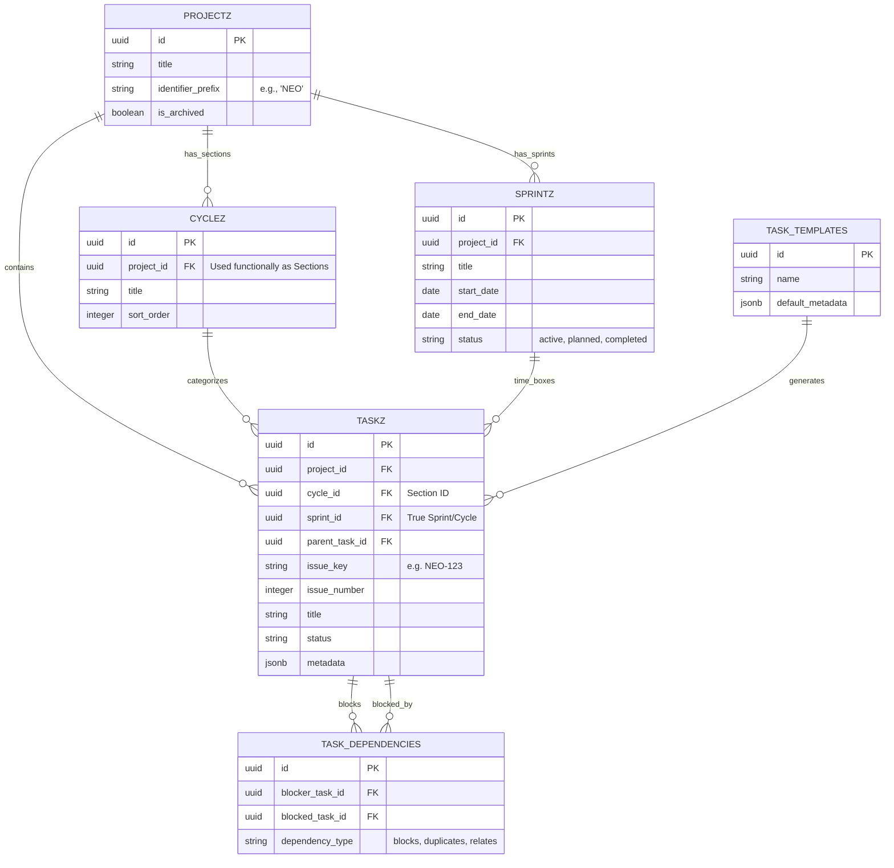

# Task Engine Evolution: Milestone 1 Analysis

> [!NOTE] 
> **Executive Summary:** The current Neogleamz Task Engine (`task-engine.js`) implements a lightweight, Vanilla JS list-view interface strongly resembling early-stage Asana. While functionally sound for basic hierarchy (Projects ➔ Sections ➔ Tasks ➔ Subtasks), it critically lacks the temporal constraints of Linear (Sprints), the visual spatial mapping of Jira (Kanban), and robust issue identification. This report outlines the architectural upgrade path to achieve industry-leading parity while strictly adhering to the 100% Vanilla JS and dynamic 4-State UX mandates.

---

## 🛠️ 1. Blind Market Comparison: Asana vs Jira vs Linear vs Neogleamz

| Feature Axis | 🎯 Asana | 🏗️ Jira | ⚡ Linear | 📦 Current `task-engine.js` |
| :--- | :--- | :--- | :--- | :--- |
| **Core Philosophy** | Flexible list/board multi-homing | Highly structured agile workflows | Speed, keyboard-first, opinionated | Lightweight list-based hierarchy |
| **UI Paradigm** | Tabbed (List, Board, Timeline) | Complex issue screens, Kanban | Command K, hyper-fast lists | Single unified vertical list view |
| **Data Hierarchy** | Portfolio ➔ Project ➔ Section ➔ Task | Epic ➔ Sprint ➔ Story ➔ Subtask | Team ➔ Cycle ➔ Issue | Project ➔ Cycle (Section) ➔ Task |
| **Task Identification** | Hidden UUIDs (Link based) | Auto-increment Keys (ENG-123) | Auto-increment Keys (ENG-123) | Hidden UUIDs (`task.id`) |
| **Temporal Timeboxing** | Manual due dates | Sprints with Backlogs | Cycles with automated rollover | Missing (Cyclez hijacked for Sections) |
| **Dependencies** | Blocks / Blocked By UI | Complex multi-link types | Blocking / Blocked by | Exists in schema, missing in UI |

> [!WARNING]
> **Architectural Landmine Detected:** The current database table `cyclez` has been semantically hijacked to act as Asana-style "Sections" (vertical groupings). This prevents the engine from utilizing true temporal timeboxes (Sprints). We MUST bifurcate `cyclez` (Sections) from a new `sprintz` concept to achieve Linear parity.

---

## 🧠 2. High-Priority Upgrade Proposal

Based on the market comparison, the highest-priority missing features are:
1. **Visual State Management (Kanban Boards):** Parity with Jira/Asana.
2. **Issue Identifiers (Linear-style Keys):** Parity with Jira/Linear for quick communication (e.g., `NEX-404`).
3. **Temporal Timeboxes (True Sprints):** Parity with Linear Cycles/Jira Sprints.
4. **Dependency Resolution UI:** Exposing the blocked/blocking relationships.

### Supabase PostgreSQL Schema Migrations

To support the upgrade without breaking the existing list architecture, we will execute non-destructive `ALTER` and `CREATE` migrations.

```sql
-- 1. True Sprints (Temporal Timeboxes)
CREATE TABLE public.sprintz (
    id UUID PRIMARY KEY DEFAULT uuid_generate_v4(),
    project_id UUID REFERENCES public.projectz(id) ON DELETE CASCADE,
    title TEXT NOT NULL,
    start_date DATE NOT NULL,
    end_date DATE NOT NULL,
    status TEXT DEFAULT 'Planned', -- Planned, Active, Completed
    metadata JSONB DEFAULT '{}'::jsonb
);

-- 2. Issue Identifiers
ALTER TABLE public.projectz 
ADD COLUMN identifier_prefix VARCHAR(10) UNIQUE; -- e.g. "NEO", "ENG"

ALTER TABLE public.taskz
ADD COLUMN sprint_id UUID REFERENCES public.sprintz(id) ON DELETE SET NULL,
ADD COLUMN issue_number SERIAL,
ADD COLUMN issue_key VARCHAR(20); -- Generated via trigger or edge function: "NEO-" || issue_number

-- 3. Dependency Enforcement
CREATE TABLE public.task_dependencies (
    id UUID PRIMARY KEY DEFAULT uuid_generate_v4(),
    blocker_task_id UUID REFERENCES public.taskz(id) ON DELETE CASCADE,
    blocked_task_id UUID REFERENCES public.taskz(id) ON DELETE CASCADE,
    dependency_type VARCHAR(50) DEFAULT 'blocks',
    created_at TIMESTAMPTZ DEFAULT NOW()
);
```

### Mermaid Entity-Relationship Diagram (ERD)



---

## 📦 3. Vanilla JS DOM Architecture (Kanban Engine)

> [!IMPORTANT]
> The Kanban UI must strictly obey the Dynamic 4-State UX rule (Loading, Error, Empty, Success) and rely on pure Flexbox fluid topology. No `innerHTML` event handlers are permitted. Events must use `data-click` intercept tokens.

### Raw DOM Structure

```html
<!-- Kanban Module Wrapper -->
<div id="te-kanban-wrapper" class="te-board-layout" style="display: flex; flex-direction: column; height: 100%; overflow: hidden;">
    
    <!-- State 1: LOADING -->
    <div id="te-kanban-loading" style="display: flex; flex-direction: column; align-items: center; justify-content: center; height: 100%; width: 100%;">
        <div class="spinner" style="border: 4px solid rgba(255,255,255,0.1); border-top-color: var(--primary-color); border-radius: 50%; width: 40px; height: 40px; animation: spin 1s linear infinite;"></div>
        <span style="color: var(--text-muted); margin-top: 16px; font-weight: bold; letter-spacing: 1px;">SYNCING BOARD...</span>
    </div>

    <!-- State 2: ERROR -->
    <div id="te-kanban-error" style="display: none; flex-direction: column; align-items: center; justify-content: center; height: 100%; width: 100%;">
        <span style="font-size: 32px;">⚠️</span>
        <span style="color: var(--text-heading); margin-top: 8px; font-weight: bold;">Telemetry Desync</span>
        <button class="btn-orange-neon" data-click="click_teRetryKanban" style="margin-top: 16px;">REBOOT CONNECTION</button>
    </div>

    <!-- State 3: EMPTY -->
    <div id="te-kanban-empty" style="display: none; flex-direction: column; align-items: center; justify-content: center; height: 100%; width: 100%;">
        <span style="font-size: 32px;">📭</span>
        <span style="color: var(--text-heading); margin-top: 8px; font-weight: bold;">Zero Active Tasks</span>
        <span style="color: var(--text-muted); font-size: 12px; margin-top: 4px;">Initialize a new issue to populate this board.</span>
        <button class="btn-green-neon" data-click="click_teCreateNewTask" style="margin-top: 16px;">+ INITIALIZE TASK</button>
    </div>

    <!-- State 4: SUCCESS (Populated Kanban Matrix) -->
    <div id="te-kanban-success" style="display: none; flex-direction: row; align-items: stretch; gap: 16px; padding: 16px; height: 100%; overflow-x: auto; min-width: max-content;">
        
        <!-- Column Structural Template (Dynamically cloned via JS) -->
        <div class="kanban-column" data-status="Todo" style="display: flex; flex-direction: column; width: clamp(280px, 20vw, 350px); background: rgba(255,255,255,0.02); border-radius: 8px; border: 1px solid rgba(255,255,255,0.05); max-height: 100%; flex-shrink: 0;">
            
            <!-- Column Header -->
            <div class="kanban-column-header" style="padding: 12px 16px; border-bottom: 1px solid rgba(255,255,255,0.05); display: flex; justify-content: space-between; align-items: center; position: sticky; top: 0; background: rgba(10, 10, 10, 0.9); z-index: 20;">
                <span style="color: var(--text-heading); font-weight: 900; font-size: 12px; letter-spacing: 1px;">TODO</span>
                <span class="kanban-count" style="background: rgba(255,255,255,0.1); padding: 2px 8px; border-radius: 12px; font-size: 10px; font-weight: bold; color: var(--text-muted);">0</span>
            </div>
            
            <!-- Sortable Body -->
            <div class="kanban-column-body te-sortable-board-list" data-status="Todo" style="padding: 12px; display: flex; flex-direction: column; gap: 12px; overflow-y: auto; flex-grow: 1; min-height: 50px;">
                <!-- Task Cards injected here via safeHTML() -->
            </div>
            
            <!-- Column Footer (Inline Add) -->
            <div class="kanban-column-footer" style="padding: 8px;">
                <button class="btn-blue-muted" style="width: 100%; text-align: left; padding: 8px 12px; display: flex; align-items: center; gap: 8px; font-size: 12px;" data-click="click_teInlineKanbanAdd" data-status="Todo">
                    <span style="font-weight: bold; font-size: 14px;">+</span> Add Task
                </button>
            </div>
        </div>
        
    </div>
</div>
```

> [!TIP]
> **Implementation Note:** The `.te-sortable-board-list` class will bind natively to `SortableJS` (already present in the stack), mapping cross-column drags to immediate `taskz.status` Supabase `UPDATE` payloads via the `onEnd` event hook.

---

## 4. Next Steps
To proceed to Milestone 2, we must apply the SQL migrations to the Supabase instance, update the `system-event-delegator.js` to handle the new Kanban action tokens, and append the board rendering loop into `task-engine.js`.
