# Handoff Report: Frontend UI & Architecture Audit

## 1. Observation
- The frontend is built as a monolithic Single Page Application (SPA) driven by a 500KB+ `index.html` file and modular Vanilla JS files located in `assets/js/`.
- Executed custom Node.js parser scripts (`parse_ui.js`, `parse_tabs.js`) against `index.html` and identified exactly 6 main Hub tabs (`invhub-tab`, `prodhub-tab`, `fulfillzhub-tab`, `salezhub-tab`, `socialzhub-tab`, `synchub-tab`).
- Extracted navigation button text using regex, revealing the currently rendered UI labels: `📊 STOCKPILEZ`, `🏭 MAKERZ`, `📦 FULFILLZ`, `🛒 REVENUEZ`, `👥 SOCIALZ`, `⚡ NEXUZ`.
- Discovered exactly 30 unique `modal-overlay` elements nested within `index.html`, including `actual-net-modal`, `math-simulator-modal`, `analytics-modal`, `sopMasterModal`, `recipeManagerModal`, `taskPlannerModal`, and `migration-modal`.
- Analyzed the JS module structure, noting files like `inventory-module.js`, `production-module.js`, `packerz-module.js`, and `system-tools-module.js` that directly map to the core hubs.

## 2. Logic Chain
- **Mapping Hubs to Canonical Names:** The user's system constraints mandate the use of `STOCKPILEZ`, `MAKERZ`, `FULFILLZ`, `REVENUEZ`, `SOCIALZ`, `NEXL`. The UI strings in the DOM (e.g., `NEXUZ`) and the `id` selectors (e.g., `invhub-tab`, `prodhub-tab`, `synchub-tab`) indicate that the codebase is heavily reliant on legacy functional naming (Inventory, Production, Sync/System). Therefore, a translation layer (Canonical Dictionary) is necessary for future engineers to navigate the DOM vs System Rules.
- **Architectural Flow:** Because there is no external routing framework (like React Router), the application relies on an event delegator (`system-event-delegator.js`) and module-specific logic (`*-module.js`) to toggle the visibility of the Hubs. The Modals act as global floating overlays that can be invoked from specific hubs or system-wide logic.

## 3. Caveats
- I did not deeply map the interior elements (like individual data tables or split panes) within each Hub due to the sheer size of `index.html` and scoping constraints. The map focuses on macro-level routing (Hubs) and major interactive overlays (Modals).
- The mapping between specific JS modules (e.g., `bom-module.js` to `invhub`) is inferred logically based on business domain terminology, rather than tracing absolute function invocations (which would require parsing dynamic `data-click` delegations across thousands of lines).

## 4. Conclusion
The frontend is structured functionally by module, but its canonical identity is transitioning toward a branded nomenclature. The application architecture centers around 6 primary Hubs and a centralized modal overlay system.

### Canonical Nomenclature Dictionary
| UI Tab Label (Found) | DOM ID (Legacy) | Canonical Name (Mandated) | Associated JS Modules |
| --- | --- | --- | --- |
| 📊 STOCKPILEZ | `invhub-tab` | **STOCKPILEZ** | `inventory-module.js`, `bom-module.js` |
| 🏭 MAKERZ | `prodhub-tab` | **MAKERZ** | `production-module.js`, `barcodz-module.js` |
| 📦 FULFILLZ | `fulfillzhub-tab` | **FULFILLZ** | `packerz-module.js`, `print-module.js`, `labelz-module.js` |
| 🛒 REVENUEZ | `salezhub-tab` | **REVENUEZ** | `sales-module.js`, `ceo-module.js` |
| 👥 SOCIALZ | `socialzhub-tab` | **SOCIALZ** | `socialz-module.js` |
| ⚡ NEXUZ | `synchub-tab` | **NEXL** | `system-tools-module.js`, `task-engine.js` |

### Architectural Hierarchy Diagram

```mermaid
graph TD
    App[index.html SPA]
    
    %% Hubs Layer
    App --> Stockpilez[STOCKPILEZ Hub<br>DOM: invhub-tab]
    App --> Makerz[MAKERZ Hub<br>DOM: prodhub-tab]
    App --> Fulfillz[FULFILLZ Hub<br>DOM: fulfillzhub-tab]
    App --> Revenuez[REVENUEZ Hub<br>DOM: salezhub-tab]
    App --> Socialz[SOCIALZ Hub<br>DOM: socialzhub-tab]
    App --> Nexl[NEXL Hub<br>DOM: synchub-tab]

    %% Example Modules Layer
    Stockpilez -.-> InventoryModule[inventory-module.js]
    Stockpilez -.-> BomModule[bom-module.js]
    
    Makerz -.-> ProductionModule[production-module.js]
    Makerz -.-> BarcodzModule[barcodz-module.js]
    
    Fulfillz -.-> PackerzModule[packerz-module.js]
    Fulfillz -.-> PrintModule[print-module.js]
    Fulfillz -.-> LabelzModule[labelz-module.js]

    Revenuez -.-> SalesModule[sales-module.js]
    Revenuez -.-> CeoModule[ceo-module.js]

    Socialz -.-> SocialzModule[socialz-module.js]

    Nexl -.-> SystemToolsModule[system-tools-module.js]
    Nexl -.-> TaskEngine[task-engine.js]
    
    %% Core Engines
    Core[Core Engines]
    App --> Core
    Core -.-> NeogleamzEngine[neogleamz-engine.js]
    Core -.-> EventDelegator[system-event-delegator.js]
    Core -.-> ScraperModule[scraper-module.js]
    Core -.-> AnalyticsModule[analytics-module.js]
    
    %% Global Modals (Grouped for simplicity)
    Modals[Global Overlay Modals]
    App --> Modals
    Modals -.-> SOP[SOP Master/Viewer]
    Modals -.-> Recipe[Recipe Manager]
    Modals -.-> Data[Actual Net / Analytics / Task Planner]
```

## 5. Verification Method
- Execute `cat index.html | grep 'id="[a-z]*hub-tab"'` to verify the legacy DOM node naming.
- Run `cat index.html | grep 'class="modal-overlay"'` to confirm the count and IDs of the modals mapping to the overlay structure.
- Look at `assets/js` structure to verify that the modules map intuitively to the Hub names referenced in the Canonical Nomenclature Dictionary.
