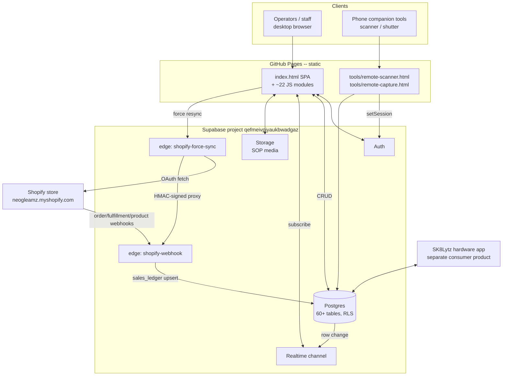
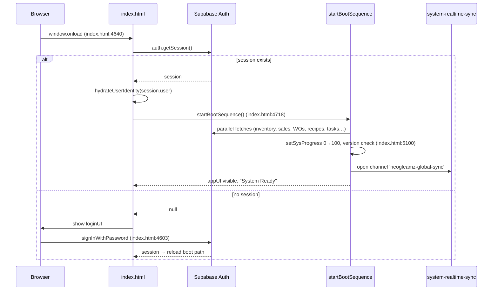
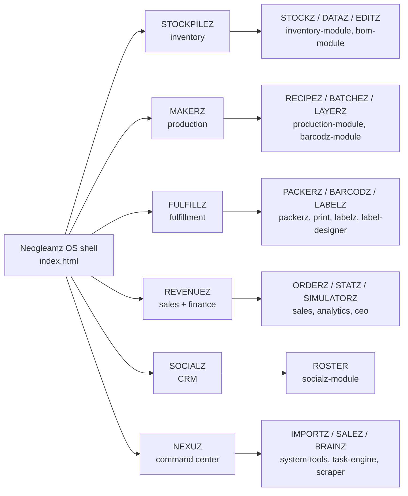
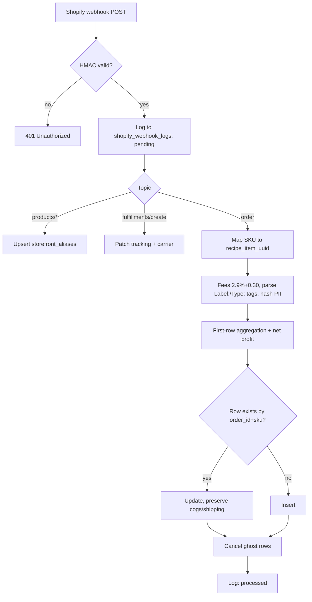
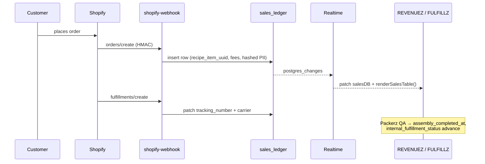

# Neogleamz OS — System Architecture

> **Status:** Descriptive (reverse-engineered from source) · **Generated:** 2026-06-20 · **Scope:** the `neogleamz.github.io` repository (the Neogleamz OS / SK8Lytz ERP web app), its Supabase backend, and its Shopify edge functions.
>
> This document was produced by reading the actual source. Citations use `path:line` form. Where the canonical specs ([`tools/SK8Lytz_App_Master_Reference.md`](../tools/SK8Lytz_App_Master_Reference.md) and [`CLAUDE.md`](../CLAUDE.md)) and the live code agree, that is noted; where they diverge, the **code** is treated as ground truth.

---

## 1. Executive overview

Neogleamz OS (UI title "Neogleamz Command Center", [`index.html:8`](../index.html)) is an **internal business-operations platform** for Neogleamz / SK8Lytz, a skate-LED hardware company. It is a single-page application that runs the company's entire physical-goods pipeline: raw-material inventory, bill-of-materials recipes, 3D-print and assembly production, order fulfillment, label/barcode printing, Shopify sales ingestion, profitability analysis, an influencer CRM, and an Asana-style task/project engine.

Three facts define the whole architecture:

1. **Zero build step.** The repository root *is* the deployed website. It is served as public **GitHub Pages**; pushing `main` auto-deploys. There is no bundler, transpiler, or framework — pure vanilla HTML/CSS/JS ([`tools/SK8Lytz_App_Master_Reference.md:180`](../tools/SK8Lytz_App_Master_Reference.md), confirmed by the script-tag module loading in `index.html`).
2. **Supabase is the entire backend.** A single hosted Postgres project (`qefmeivpjyaukbwadgaz`) provides the database (60+ tables), authentication, row-level security, realtime websockets, and storage. Two Deno **edge functions** handle Shopify ingestion. There is no custom application server.
3. **The database is shared by two apps.** This repo is the **ERP web app**. The same Supabase project also backs a separate **SK8Lytz consumer-hardware companion** (Web-Bluetooth skate LEDs) — visible here only as ~25 tables (`skate_sessions`, `led_diagnostics`, `registered_devices`, `crews`, `shared_scenes`, `product_catalog`, …) and two in-repo phone tools. This document covers the ERP app in depth and treats the hardware domain as adjacent shared-database context.

### 1.1 Technology stack

| Layer | Choice | Notes |
|---|---|---|
| Runtime | Vanilla JS (ES latest), no framework | No React/Vue/jQuery/TS; DOM via native APIs |
| Markup/shell | One ~7.2k-line `index.html` | Inline `<style>` + inline `<script>` + ~22 external modules |
| Styling | Native CSS variables + Flexbox | Light/dark via `data-theme`; font "Righteous" |
| State | Global `window`-scoped in-memory arrays/maps | `productsDB`, `inventoryDB`, `salesDB`, `workOrdersDB`, … |
| Backend | Supabase (Postgres + Auth + Realtime + Storage) | Project `qefmeivpjyaukbwadgaz` |
| Integrations | 2 Deno edge functions | `shopify-webhook`, `shopify-force-sync` |
| Auth | Supabase Auth (email/password) | Session in `sessionStorage` ([`index.html:4315`](../index.html)) |
| Realtime | One Supabase channel, all public tables | `neogleamz-global-sync` |
| Key CDN libs | Chart.js, SheetJS, DOMPurify, Fabric.js, html5-qrcode, JsBarcode, QRCode, bwip-js, jsPDF, SortableJS | All pinned in `index.html` |
| Tooling | ESLint 10, Prettier, Jest 30 (+ jsdom), Supabase CLI | No build; lint/test only |
| Hosting | GitHub Pages (repo root) | `main` push = deploy |

### 1.2 System context



---

## 2. Repository layout

```
neogleamz.github.io/
├── index.html                 # ~7.2k lines: shell, login, boot, Supabase init, inline CSS + core JS
├── qa-dashboard.html          # internal QA/diagnostics dashboard
├── assets/
│   ├── js/                    # ~22 feature + platform modules (the application logic)
│   └── images/                # logos (orange/white per theme)
├── supabase/
│   ├── functions/
│   │   ├── shopify-webhook/index.ts      # inbound order ingestion (HMAC)
│   │   └── shopify-force-sync/index.ts   # OAuth pull + signed proxy
│   ├── migrations/            # 00000000000000_schema.sql (baseline) + dated migrations
│   └── dumps/                 # schema + data snapshots
├── tools/
│   ├── SK8Lytz_App_Master_Reference.md   # canonical source-of-truth spec
│   ├── SK8Lytz_Bucket_List.md            # task ledger
│   ├── remote-scanner.html               # phone barcode scanner (session handoff)
│   └── remote-capture.html               # phone camera "shutter" (session handoff)
├── tests/                     # Jest + jsdom unit tests
├── coverage/                  # Jest coverage output (lcov)
├── scripts/                   # version bump, git-hook installer
├── .githooks/pre-commit       # root-whitelist guard + auto version bump
├── .claude/ + .agents/        # AI-agent workflow commands, skills, rules
├── eslint.config.mjs          # flat ESLint config (global registration)
└── CLAUDE.md                  # agent operating manual (Claude port of .agents rules)
```

The application's JavaScript deliberately lives at `assets/js/*.js` rather than a `src/` tree, because there is no build to assemble it — every file is a `<script>` include ([`tools/SK8Lytz_App_Master_Reference.md:181`](../tools/SK8Lytz_App_Master_Reference.md)).

---

## 3. Runtime architecture

### 3.1 The zero-build, global-namespace model

Because modules are plain `<script>` tags (no `import`/`export` at runtime), every top-level `function foo()` or `window.foo = …` becomes a shared global. The codebase embraces this: modules call each other through `window.*` and bare global names. Two consequences are engineered around it:

- **ESLint registration mandate.** ESLint parses each file independently, so every cross-file global must be declared. The flat config registers browser globals and library globals (`Chart`, `DOMPurify`, `XLSX`, `Html5Qrcode`, `JsBarcode`, `QRCode`, `Sortable`, `supabaseClient`, …) under `languageOptions.globals` ([`eslint.config.mjs:21`](../eslint.config.mjs)); files that rely on app globals add a `/* global … */` header (e.g. [`assets/js/system-realtime-sync.js:1`](../assets/js/system-realtime-sync.js)).
- **Defensive `typeof` access.** Modules guard cross-module calls with `typeof fn === 'function'` before invoking, so load-order races degrade gracefully instead of throwing (pervasive; see the realtime sync accessor at [`assets/js/system-realtime-sync.js:9`](../assets/js/system-realtime-sync.js)).

### 3.2 Module load order

Order matters because later scripts depend on earlier globals. The shell loads them in three waves:

| Wave | Location | Scripts (in order) |
|---|---|---|
| Head — version + delegator + vendor | [`index.html:4`](../index.html), [`:11`–`:18`](../index.html) | `system-version.js`; then CDN: supabase-js v2, SheetJS 0.20.1, Chart.js, chartjs-plugin-datalabels, DOMPurify 3.0.5, html5-qrcode, SortableJS; then `system-event-delegator.js` |
| Mid-body — platform + features | [`index.html:6372`–`6386`](../index.html) | `neogleamz-engine.js`, `kpi-reports-module.js`, `system-realtime-sync.js`, `system-tools-module.js`, `bom-module.js`, `inventory-module.js`, `packerz-module.js`, `production-module.js`, `sales-module.js`, `analytics-module.js`, `ceo-module.js`, `task-engine.js`, `print-module.js`, `scraper-module.js`, `socialz-module.js` |
| Late — print/label vendor + modules | [`index.html:7167`–`7179`](../index.html) | CDN: JsBarcode 3.11.6, QRCode 1.5.3, html5-qrcode 2.3.8, Fabric 5.3.0, bwip-js 3.4.1, jsPDF; then `barcodz-module.js`, `label-designer.js`, `labelz-module.js` |

All app modules carry a `?v=v.YYYY.MM.DD.HHMM` cache-busting query that the pre-commit hook rewrites on every commit (§11).

### 3.3 Boot and authentication sequence

Supabase is initialized once with session persistence in `sessionStorage` (not `localStorage`), auto token refresh, and URL session detection ([`index.html:4315`](../index.html)). On page load the app checks for an existing session and either boots or shows the login UI.



Logout calls `auth.signOut()` ([`index.html:4623`](../index.html)). A global telemetry logger `sysLog(msg, isError, payload, isTelemetry)` ([`index.html:4378`](../index.html)) captures everything; `window.onerror` ([`index.html:4418`](../index.html)) and `unhandledrejection` ([`index.html:4419`](../index.html)) funnel uncaught faults into it, with a second, noise-filtering pair of handlers in the engine ([`assets/js/neogleamz-engine.js:30`](../assets/js/neogleamz-engine.js)).

---

## 4. Frontend architecture

### 4.1 Hubs, panes, and modules

The UI is organized into six top-level **hubs**, each containing **panes**, each backed by one or more JS modules. Canonical labels use the brand "-Z" nomenclature ([`tools/SK8Lytz_App_Master_Reference.md:9`](../tools/SK8Lytz_App_Master_Reference.md)).



Tab switching is centralized in `switchTab(tabId)` ([`index.html:5119`](../index.html)); FULFILLZ and NEXUZ have dedicated console loaders ([`index.html:5202`](../index.html), [`:5216`](../index.html)). A complete element-by-element binding map of every pane, modal, and button lives in the Master Reference §6.

### 4.2 CSS design system

All styling is hand-authored CSS in the `index.html` `<style>` block, driven by CSS custom properties. The light palette is defined on `:root` ([`index.html:26`–`40`](../index.html)) and the dark palette overrides it under `[data-theme="dark"]` ([`index.html:42`–`56`](../index.html)); `toggleTheme()` flips the attribute and persists the choice in `localStorage` ([`index.html:4374`](../index.html)). Tokens include surface colors (`--bg-body`, `--bg-container`, `--bg-panel`), text (`--text-main`, `--text-heading`, `--text-muted`), glassmorphism (`--bg-glass`, `--glass-border`, `--glass-shadow`), and semantic kitting-tray colors. The base font is **Righteous** ([`index.html:63`](../index.html)). Neon accent tokens (`--neon-green`, `--neon-cyan`, …) are scoped to the CEO/finance terminal ([`index.html:2508`](../index.html)).

Documented layout standards (Master Reference §2): a strict **z-index hierarchy** (base 0-1 → resizers 10 → sticky `th` 20 → pane headers 50 → dropdowns 500 → modal overlays 10000+); a **3-intensity button matrix** (neon / standard-ghost / muted) keyed to four semantic colors (green=commit, red=destructive, orange=edit, blue=neutral); responsive Flexbox with `clamp()` scaling and 48px minimum tap targets; and a mandated **"Close"** text label on dialogs (never an "X").

### 4.3 Event delegation

Inline handlers (`onclick=`) are forbidden. Instead, interactive elements carry `data-click` / `data-change` / `data-input` tokens, and one delegator bound at `DOMContentLoaded` ([`assets/js/system-event-delegator.js:13`](../assets/js/system-event-delegator.js)) catches bubbled events on `document.body`, resolves `event.target.closest('[data-click]')` ([`:18`](../assets/js/system-event-delegator.js)), emits a telemetry log ([`:28`](../assets/js/system-event-delegator.js)), and dispatches through a large `switch(action)` to the matching `window.*` function ([`:29`](../assets/js/system-event-delegator.js)). This keeps handlers off the DOM (so they survive `innerHTML` sanitization) and avoids per-element listener leaks.

### 4.4 DOM security: `safeHTML`

Any dynamic HTML assigned via `innerHTML` must pass through `window.safeHTML()` ([`assets/js/neogleamz-engine.js:52`](../assets/js/neogleamz-engine.js)), a DOMPurify wrapper. Its config is purpose-built for this app: it permits `iframe/video/source` tags (for SOP media) and, critically, **allow-lists every `data-*` action token** (`data-click`, `data-change`, `data-oid`, …) so delegated handlers survive sanitization ([`:56`](../assets/js/neogleamz-engine.js)). If DOMPurify failed to load, it falls back to a text-escaping div ([`:60`](../assets/js/neogleamz-engine.js)).

### 4.5 Mandatory UI interaction patterns

- **Button mutex / progress.** Every DB-mutating button is wrapped in `executeWithButtonAction(btnId, 'LOADING…', '✅ SAVED', async () => {…})` ([`index.html:4804`](../index.html)), which locks the control against double-submit and animates Save → Saving… → Saved!.
- **4-state UX.** Every data view handles Loading / Error (with fallback) / Empty / Success.
- **Zero-refresh.** After a mutation resolves, the affected `render*()` functions are re-invoked immediately and propagated to every dependent view — the user never manually refreshes.
- **Chart hygiene.** Chart.js instances are `.destroy()`-ed before repaint to prevent ghosting.
- **Sort/preference persistence.** Table sorts persist via `window.saveSort(key, val)` → `localStorage` ([`index.html:4318`](../index.html)); broader prefs sync through `saveCloudPrefs()`.

---

## 5. Core platform modules

These cross-cutting modules provide the services every feature depends on.

### 5.1 `neogleamz-engine.js` — the calculation + safety core
Holds global config `NEOGLEAMZ_CONFIG` (Stripe 2.9% + $0.30, eBay blended 23.88%, default shipping $8.00) ([`assets/js/neogleamz-engine.js:20`](../assets/js/neogleamz-engine.js)); the noise-filtered global error handlers ([`:30`](../assets/js/neogleamz-engine.js)); `safeHTML` (§4.4); the recursive landed-cost engine `calculateProductBreakdown(pName)` that rolls up raw + labor cost through nested sub-assemblies with a `visited` cycle guard ([`:72`](../assets/js/neogleamz-engine.js)); and the family of pane stat aggregators `syncDatazStats … syncFulfillzStats` ([`:616`–`1085`](../assets/js/neogleamz-engine.js)) that recompute the headline numbers on each hub.

### 5.2 `system-event-delegator.js` — input routing
The global delegated event controller (§4.3).

### 5.3 `system-realtime-sync.js` — live state propagation
Covered in detail in §7.

### 5.4 `system-tools-module.js` — NEXUZ data ops
Bulk import/restore plumbing: `runFileImport` ([`assets/js/system-tools-module.js:1065`](../assets/js/system-tools-module.js)), `extractOrders` / `extractParcels` ([`:1252`](../assets/js/system-tools-module.js), [`:1346`](../assets/js/system-tools-module.js)), `syncAndCalculate` ([`:1408`](../assets/js/system-tools-module.js)), the irreversible `commitLiveRestore` ([`:1780`](../assets/js/system-tools-module.js)), and paper-profile management for printing ([`:2107`+](../assets/js/system-tools-module.js)).

### 5.5 `task-engine.js` — the ERP command center
An Asana-style hierarchical project/task system linking work to physical modules. Provides `generateUUID` ([`assets/js/task-engine.js:6`](../assets/js/task-engine.js)), team membership checks ([`:26`](../assets/js/task-engine.js)), bulk fetch `teFetchAllData` ([`:63`](../assets/js/task-engine.js)), inbox badges ([`:97`](../assets/js/task-engine.js)), sidebar/grid renderers ([`:117`](../assets/js/task-engine.js), [`:196`](../assets/js/task-engine.js)), and recursive task-row HTML ([`:691`](../assets/js/task-engine.js)). It is backed by the `projectz / cyclez / taskz / teams / task_dependencies / task_comments / task_activity / task_templates` table cluster (§9).

### 5.6 `system-version.js`
Loaded first ([`index.html:4`](../index.html)); exposes the running version string that the boot sequence compares against the last-seen version to surface an "updated" toast ([`index.html:5100`](../index.html)). The pre-commit hook rewrites it automatically (§11).

---

## 6. Real-time synchronization

`system-realtime-sync.js` keeps every operator's screen live without polling or full refetches.

**Mechanism.** It opens a single Supabase channel `neogleamz-global-sync` ([`assets/js/system-realtime-sync.js:97`](../assets/js/system-realtime-sync.js)) and subscribes to `postgres_changes` for `event: '*', schema: 'public'` ([`:142`](../assets/js/system-realtime-sync.js)) — i.e. every INSERT/UPDATE/DELETE on every public table. A safe accessor `getGlobal(name)` ([`:9`](../assets/js/system-realtime-sync.js)) resolves ~60 in-memory caches (`inventoryDB`, `salesDB`, `workOrdersDB`, `taskEngineDB`, `productsDB`, …) and their matching `render*` functions via `typeof` guards.

**Per-table patching (zero-cache).** On a change, the handler reads `payload.eventType` ([`:144`](../assets/js/system-realtime-sync.js)) and, per table, splices the single affected object directly into the relevant in-memory array (INSERT/UPDATE/DELETE branches throughout [`:162`–`:511`](../assets/js/system-realtime-sync.js)), then calls only that table's render function — avoiding a network round-trip.

**Focus guard.** To avoid yanking the UI while someone is typing in a grid, if `document.activeElement` is an INPUT/TEXTAREA/SELECT inside a table/pane/task wrapper, renders are buffered and replayed on `blur` ([`:104`–`128`](../assets/js/system-realtime-sync.js)).

```mermaid
sequenceDiagram
    participant Op2 as Operator B writes
    participant DB as Postgres
    participant Ch as neogleamz-global-sync
    participant H as sync handler
    participant Cache as in-memory DB array
    participant UI as Operator A screen

    Op2->>DB: UPDATE work_orders
    DB-->>Ch: postgres_changes {event:*, schema:public}
    Ch->>H: payload (eventType, table, new/old)
    alt user A is typing in a grid
        H->>H: buffer; re-run on blur (L104-128)
    else idle
        H->>Cache: splice updated row into workOrdersDB (L162+)
        H->>UI: renderWOList() / renderActiveWO()
    end
```

---

## 7. Feature module reference

Each entry lists the module's responsibility and its most important functions with line citations. Function inventories were extracted directly from source.

### 7.1 STOCKPILEZ — inventory & BOM

**`inventory-module.js`** — the stock lifecycle. Sortable FGI and raw-goods tables (`sortFGI`/`sortInventory` [`:34`–`35`](../assets/js/inventory-module.js)), `renderFgiTable` ([`:37`](../assets/js/inventory-module.js)), `renderInventoryTable` ([`:235`](../assets/js/inventory-module.js)), inline edits with optimistic write-back `handleInvEdit` ([`:363`](../assets/js/inventory-module.js)), and `runProductionBatch` ([`:415`](../assets/js/inventory-module.js)) which deducts components. Backed by `inventory_consumption`, `inventory_adjustments_log`, `inventory_snapshots`.

**`bom-module.js`** — recipe authoring via drag-and-drop. `productDragStart/Over/Drop` ([`:356`–`363`](../assets/js/bom-module.js)) compose `product_recipes.components` (a JSONB BOM). Persists user layout through `saveCloudPrefs` ([`:376`](../assets/js/bom-module.js)).

### 7.2 MAKERZ — production

**`production-module.js`** (the largest feature module). Work-order lifecycle and SOP authoring: media modal ([`:30`](../assets/js/production-module.js)), SOP master editor ([`:117`](../assets/js/production-module.js)), `renderMasterSOP` ([`:223`](../assets/js/production-module.js)), routing analysis `checkWORouting` ([`:609`](../assets/js/production-module.js)), `getDirectMaterials` ([`:728`](../assets/js/production-module.js)) and `find3DPrintedComponents` ([`:789`](../assets/js/production-module.js)) for multi-level explosion, `validateAndCreateWO` ([`:1062`](../assets/js/production-module.js)), `renderActiveWO` ([`:1439`](../assets/js/production-module.js)), the status machine `advanceWO` ([`:1820`](../assets/js/production-module.js)), WIP checkbox persistence into `work_orders.wip_state` ([`:1270`](../assets/js/production-module.js)), archive explorer ([`:2106`+](../assets/js/production-module.js)), and pick-list printing ([`:2321`](../assets/js/production-module.js)). Backed by `work_orders`, `production_sops`, `product_recipes`, `sop_archives`.

**`barcodz-module.js`** — barcode spool generation for production/fulfillment: `buildBarcodzCache` ([`:25`](../assets/js/barcodz-module.js)), `renderBarcodzSpool` ([`:266`](../assets/js/barcodz-module.js)), thermal-media consumption `consumeThermalMedia` ([`:519`](../assets/js/barcodz-module.js)).

### 7.3 FULFILLZ — packing, printing, labels

**`packerz-module.js`** — order packing with camera-verified QA. Fetches unfulfilled orders ([`:73`](../assets/js/packerz-module.js)), maps recipes to live Shopify variants ([`:213`](../assets/js/packerz-module.js)), runs an SOP terminal with scan sign-off ([`:367`](../assets/js/packerz-module.js), `signoffPackerzQA` [`:1078`](../assets/js/packerz-module.js)), executes completion + inventory deduction ([`:1302`](../assets/js/packerz-module.js)), manages SOP media in Supabase Storage ([`:1890`–`2002`](../assets/js/packerz-module.js)), archives immutable SOP snapshots ([`:2272`](../assets/js/packerz-module.js)), and drives a `html5-qrcode` camera scanner ([`:2537`–`2589`](../assets/js/packerz-module.js)). Backed by `pack_ship_sops`, `sop_archives`, `sales_ledger`.

**`print-module.js`** — the 3D-print queue + inventory math. Queue render ([`:79`](../assets/js/print-module.js)), drag reorder ([`:159`+](../assets/js/print-module.js)), active-job timers ([`:185`](../assets/js/print-module.js), [`:1197`](../assets/js/print-module.js)), and the consumption engines `executeCleaningInventoryMath` ([`:555`](../assets/js/print-module.js)) and `executePrintInventoryMath` ([`:599`](../assets/js/print-module.js)) that debit filament on success/scrap, plus the status machine `advancePrintStatus` ([`:693`](../assets/js/print-module.js)). Backed by `print_queue` (with `wip_state` JSONB).

**`labelz-module.js`** + **`label-designer.js`** — a Fabric.js visual label designer. History/undo ([`:43`–`75`](../assets/js/labelz-module.js)), canvas init ([`:316`](../assets/js/labelz-module.js)), text/barcode objects ([`:491`](../assets/js/labelz-module.js), [`:639`](../assets/js/labelz-module.js)), and the low-level pointer/render engine in `label-designer.js` (`ldRender` [`:366`](../assets/js/label-designer.js), pointer handlers [`:532`–`583`](../assets/js/label-designer.js)). Templates persist to `label_templates` / `label_designs`.

### 7.4 REVENUEZ — sales & finance

**`sales-module.js`** — the financial ledger. Client-side PII hashing `hashPII` ([`:30`](../assets/js/sales-module.js)), CSV import pipeline `processSalesCSV` → `processParsedSales` ([`:131`](../assets/js/sales-module.js), [`:164`](../assets/js/sales-module.js)), SKU→recipe alias mapping ([`:317`–`319`](../assets/js/sales-module.js)), the upsert engine `executeSalesSync` ([`:693`](../assets/js/sales-module.js)), the ledger grid with inline edit ([`:847`](../assets/js/sales-module.js), [`:1039`](../assets/js/sales-module.js)), and a what-if **Math Simulator** ([`:1154`–`1427`](../assets/js/sales-module.js)). Backed by `sales_ledger`, `storefront_aliases`.

**`analytics-module.js`** — STATZ dashboards: `renderAnalyticsDashboard` ([`:23`](../assets/js/analytics-module.js)), profit `renderWaterfallChart` ([`:93`](../assets/js/analytics-module.js)), expense doughnut ([`:156`](../assets/js/analytics-module.js)), trends ([`:189`](../assets/js/analytics-module.js)), and a `renderProfitabilityMatrix` ([`:242`](../assets/js/analytics-module.js)).

**`ceo-module.js`** — the SIMULATORZ "A.I. CFO" terminal. A drag-orderable product board ([`:21`+](../assets/js/ceo-module.js)) that simulates P&L without touching live data: `updateCeoEngine` ([`:251`](../assets/js/ceo-module.js)), `_buildCeoTable` ([`:329`](../assets/js/ceo-module.js)), waterfall charts ([`:464`](../assets/js/ceo-module.js)), and an LTV/cohort "whales" view ([`:657`](../assets/js/ceo-module.js)).

### 7.5 SOCIALZ — CRM

**`socialz-module.js`** — an influencer/skater outreach roster rendering `.skater-card` grids and an analytics dashboard, backed by `socialz_audience`.

### 7.6 NEXUZ — command center

**`scraper-module.js`** — the "Scraper Foundry" visual extraction engine: ingests a saved HTML page ([`:262`](../assets/js/scraper-module.js)), x-rays its DOM ([`:275`](../assets/js/scraper-module.js)), computes relative selectors ([`:374`](../assets/js/scraper-module.js)), and renders a structured dataset ([`:463`](../assets/js/scraper-module.js)) — used to pull supplier/cost data. Plus `system-tools-module.js` (§5.4) and `task-engine.js` (§5.5).

**`kpi-reports-module.js`** — cross-hub reporting helpers (`getUniqueParcels` [`:180`](../assets/js/kpi-reports-module.js), `getEditzCategorizedLists` [`:256`](../assets/js/kpi-reports-module.js)).

---

## 8. Data layer (Supabase / Postgres)

The baseline schema [`supabase/migrations/00000000000000_schema.sql`](../supabase/migrations/00000000000000_schema.sql) defines **60+ tables** plus custom enums (`project_visibility`, `project_status`). They fall into five domains; the first three belong to this ERP app, the fourth is shared infrastructure, and the fifth belongs to the separate SK8Lytz hardware product but lives in the same database.

### 8.1 Table catalog

| Domain | Tables |
|---|---|
| **Sales & inventory (ERP core)** | `sales_ledger` ([`:1786`](../supabase/migrations/00000000000000_schema.sql)), `inventory_consumption` ([`:1339`](../supabase/migrations/00000000000000_schema.sql)), `inventory_adjustments_log` ([`:1320`](../supabase/migrations/00000000000000_schema.sql)), `inventory_snapshots` ([`:1358`](../supabase/migrations/00000000000000_schema.sql)), `full_landed_costs` ([`:1235`](../supabase/migrations/00000000000000_schema.sql)), `storefront_aliases` ([`:2000`](../supabase/migrations/00000000000000_schema.sql)), `shopify_webhook_logs` ([`:1860`](../supabase/migrations/00000000000000_schema.sql)), `raw_orders`, `raw_parcel_items`, `raw_parcel_summary` |
| **Products & manufacturing** | `product_catalog` ([`:1503`](../supabase/migrations/00000000000000_schema.sql)), `product_recipes` ([`:1530`](../supabase/migrations/00000000000000_schema.sql)), `production_sops` ([`:1554`](../supabase/migrations/00000000000000_schema.sql)), `work_orders` ([`:2233`](../supabase/migrations/00000000000000_schema.sql)), `print_queue` ([`:1486`](../supabase/migrations/00000000000000_schema.sql)), `pack_ship_sops` ([`:1432`](../supabase/migrations/00000000000000_schema.sql)), `sop_archives` ([`:1986`](../supabase/migrations/00000000000000_schema.sql)) |
| **Task engine (ERP command center)** | `projectz` ([`:1564`](../supabase/migrations/00000000000000_schema.sql)), `cyclez` ([`:1162`](../supabase/migrations/00000000000000_schema.sql)), `taskz` ([`:2091`](../supabase/migrations/00000000000000_schema.sql)), `teams` ([`:2126`](../supabase/migrations/00000000000000_schema.sql)), `team_members` ([`:2117`](../supabase/migrations/00000000000000_schema.sql)), `task_dependencies` ([`:2068`](../supabase/migrations/00000000000000_schema.sql)), `task_comments` ([`:2056`](../supabase/migrations/00000000000000_schema.sql)), `task_activity` ([`:2044`](../supabase/migrations/00000000000000_schema.sql)), `task_templates` ([`:2077`](../supabase/migrations/00000000000000_schema.sql)), `template_subtasks` ([`:2166`](../supabase/migrations/00000000000000_schema.sql)), `tagz` ([`:2033`](../supabase/migrations/00000000000000_schema.sql)) |
| **App settings & utility** | `app_settings` ([`:1037`](../supabase/migrations/00000000000000_schema.sql)), `sk8lytz_app_settings` ([`:1873`](../supabase/migrations/00000000000000_schema.sql)), `label_templates` ([`:1386`](../supabase/migrations/00000000000000_schema.sql)), `label_designs` ([`:1370`](../supabase/migrations/00000000000000_schema.sql)), `custom_builder_presets` ([`:1147`](../supabase/migrations/00000000000000_schema.sql)), `user_saved_presets` ([`:2218`](../supabase/migrations/00000000000000_schema.sql)), `feature_flags` ([`:1223`](../supabase/migrations/00000000000000_schema.sql)), `tipz` ([`:2177`](../supabase/migrations/00000000000000_schema.sql)), `socialz_audience` ([`:1951`](../supabase/migrations/00000000000000_schema.sql)), `admin_audit_logs` ([`:1024`](../supabase/migrations/00000000000000_schema.sql)) |
| **SK8Lytz hardware / telemetry (shared DB, not this app)** | `skate_spots`, `skate_sessions`, `led_diagnostics`, `registered_devices`, `registered_groups`, `device_group_members`, `discovered_devices_telemetry`, `hardware_blacklist`, `daemon_status`, `telemetry_errors`, `telemetry_snapshots`, `parsed_session_stats`, `push_tokens`, `crews`, `crew_members`, `crew_memberships`, `crew_sessions`, `shared_scenes`, `sk8lytz_picks`, `user_profiles`, `user_lifetime_stats`, `remote_debug_logs` |

### 8.2 Key table shapes

- **`sales_ledger`** ([`:1786`–`1838`](../supabase/migrations/00000000000000_schema.sql)) — the financial heart, ~50 columns. PK `order_id` (text) plus surrogate `id` (uuid). Carries sale economics (`actual_sale_price`, `cogs_at_sale`, `subtotal`, `shipping`, `taxes`, `discount_amount`, `transaction_fees`, `net_profit`, `actual_payout`, `actual_shipping_cost`, `refunded_amount`), Shopify metadata (`financial_status`, `fulfillment_status`, `tracking_number`, `carrier_name`, `tags`), workflow state (`internal_fulfillment_status`, `qa_cleared_at`, `assembly_completed_at`), a `transaction_type` discriminator (Sale / Refund / Cancelled / Warranty / …), the recipe link `recipe_item_uuid`, and **four PII hash columns only** (`customer_email_hash`, `customer_phone_hash`, `shipping_name_hash`, `shipping_address_hash`) — never raw PII.
- **`product_recipes`** ([`:1530`–`1548`](../supabase/migrations/00000000000000_schema.sql)) — keyed by `product_item_uuid` (uuid, **not** a name), with a JSONB `components` BOM, costing fields (`labor_time_mins`, `labor_rate_hr`, `msrp`, `wholesale_price`, `affiliate_pct`, `warranty_pct`), and 3D-print/label flags (`is_3d_print`, `print_time_mins`, `print_grams`, `is_label`, `filament_item_uuid`).
- **`product_catalog`** ([`:1503`–`1524`](../supabase/migrations/00000000000000_schema.sql)) — the hardware product definitions (LED `default_led_points`, `default_segments`, `default_ic_type`, and `viz_shape` constrained to `RING`/`OVAL`/`DUAL_STRIP`).
- **`work_orders`** ([`:2233`](../supabase/migrations/00000000000000_schema.sql)) — PK `wo_id`, with `status`, timestamps, and **native JSONB** `wip_state` + `routing` (the standard is to store live JSON objects, never stringified — Master Reference §3).

### 8.3 The UUID-first principle

A core backend rule: the database is the source of truth, and joins must use explicit UUIDs/foreign keys rather than fuzzy frontend name-matching ([`CLAUDE.md`](../CLAUDE.md), "Database engineering"). This is visible in the recent migration away from name keys to `product_item_uuid` / `recipe_item_uuid` / `filament_item_uuid`, and is enforced even at the edge: the webhook stores `recipe_item_uuid` as `null` rather than a name string when no UUID match exists, to avoid Postgres `22P02` type errors aborting the insert ([`supabase/functions/shopify-webhook/index.ts:34`–`38`](../supabase/functions/shopify-webhook/index.ts)).

### 8.4 Row-Level Security posture

All tables are RLS-gated. A real security incident is recorded in [`supabase/migrations/20260617120000_harden_anon_rls.sql`](../supabase/migrations/20260617120000_harden_anon_rls.sql): a live anon-key probe on 2026-06-17 confirmed anonymous internet users could **read and even INSERT/DELETE** several tables, because their policies used `USING(true)/WITH CHECK(true)` with no `TO` role clause (defaulting to `PUBLIC`, which includes `anon`) combined with Supabase's default `GRANT ALL TO anon`. Exposed: `inventory_snapshots`, `label_templates`, `tipz` (leaking `user_email`), `custom_builder_presets`. The migration re-scoped those policies `TO authenticated`. Still explicitly **deferred** (documented at the file's tail): `feature_flags`, `daemon_status`, `discovered_devices_telemetry`, `remote_debug_logs`, `telemetry_errors` — kept open pending a decision about unauthenticated daemon/telemetry writers.

### 8.5 Backups & disaster recovery

The NEXUZ **Brainz** panel provides client-side `.xlsx` exports of critical ledgers and a strict three-stage restore: sandbox-stage the backup into the UI for visual inspection, manually select target tables, then execute the irreversible `commitLiveRestore` overwrite ([`assets/js/system-tools-module.js:1780`](../assets/js/system-tools-module.js); Master Reference §4). Supabase's own daily PITR backups are the second line, and monthly CSV exports of master ledgers to OneDrive are the off-platform safety net.

---

## 9. Integrations & edge functions

Both integrations are Deno functions deployed to Supabase Edge. Shopify is **webhook-push only** — the app does not poll Shopify's API for routine operation (historical pulls require OAuth, handled separately by force-sync).

### 9.1 `shopify-webhook` — inbound order ingestion

[`supabase/functions/shopify-webhook/index.ts`](../supabase/functions/shopify-webhook/index.ts) (480 lines). Flow:

1. **Auth.** POST-only. Computes HMAC-SHA256 over the raw body and constant-compares to `x-shopify-hmac-sha256`; failure → 401 ([`:17`–`30`](../supabase/functions/shopify-webhook/index.ts), [`:73`](../supabase/functions/shopify-webhook/index.ts)). Must be deployed `--no-verify-jwt` or Supabase rejects Shopify's unauthenticated POST before the parser runs (Master Reference §7).
2. **Replay mode.** A UI-triggered `{action:'replay', shopify_event_id}` bypasses HMAC and re-loads a stored payload from `shopify_webhook_logs` ([`:60`–`70`](../supabase/functions/shopify-webhook/index.ts)).
3. **Forensic log.** Every native event is logged to `shopify_webhook_logs` with `status:'pending'`; the unique `shopify_event_id` gives idempotency (duplicate code `23505` is tolerated) ([`:79`–`85`](../supabase/functions/shopify-webhook/index.ts)).
4. **Topic router.** `products/update|create` → upsert `storefront_aliases` (SKU/barcode) ([`:89`–`121`](../supabase/functions/shopify-webhook/index.ts)); `fulfillments/create` → patch `tracking_number`/`carrier_name` onto the ledger ([`:124`–`133`](../supabase/functions/shopify-webhook/index.ts)); otherwise full order parse.
5. **Order parse.** Builds the alias map SKU→`recipe_item_uuid` ([`:140`–`152`](../supabase/functions/shopify-webhook/index.ts)); estimates the processor fee as 2.9% + $0.30 ([`:162`](../supabase/functions/shopify-webhook/index.ts)); scans `order.tags` for `Label: $X` (overrides shipping cost) and `Type: X` (overrides transaction type) ([`:188`](../supabase/functions/shopify-webhook/index.ts), [`:195`](../supabase/functions/shopify-webhook/index.ts)); hashes PII with SHA-256 ([`:8`](../supabase/functions/shopify-webhook/index.ts), [`:202`–`205`](../supabase/functions/shopify-webhook/index.ts)).
6. **First-row aggregation.** Order-level shipping/tax/fees/refunds are attached only to line-item index 0 to faithfully replicate the legacy CSV layout ([`:248`–`254`](../supabase/functions/shopify-webhook/index.ts)); net profit is computed per row ([`:295`](../supabase/functions/shopify-webhook/index.ts)).
7. **Idempotent upsert.** Existing rows are matched by `order_id`+`storefront_sku` and **updated**, not duplicated; manually-entered `actual_shipping_cost`/`cogs_at_sale` are preserved (never overwritten with 0/null) and net profit/payout recomputed from the DB values ([`:379`–`408`](../supabase/functions/shopify-webhook/index.ts)).
8. **Ghost-row detection.** Line items removed from the order in Shopify are flagged `transaction_type:'Cancelled'` with zeroed economics ([`:410`–`429`](../supabase/functions/shopify-webhook/index.ts)).
9. **Status lifecycle.** The log row is finalized to `processed` or `failed` ([`:436`](../supabase/functions/shopify-webhook/index.ts), [`:462`](../supabase/functions/shopify-webhook/index.ts)).



### 9.2 `shopify-force-sync` — OAuth pull + signed proxy

[`supabase/functions/shopify-force-sync/index.ts`](../supabase/functions/shopify-force-sync/index.ts) (226 lines). Deployed **with** JWT verification (only callable by the authenticated app). It authenticates to Shopify via a **client-credentials OAuth** exchange ([`:46`–`61`](../supabase/functions/shopify-force-sync/index.ts)), then either:

- **`sync_catalog`** — paginates `products.json` (250/page, ≤10 pages, Link-header cursor) and upserts `storefront_aliases`, preserving existing `recipe_item_uuid`/`is_primary` so manual mappings survive ([`:63`–`166`](../supabase/functions/shopify-force-sync/index.ts)); or
- **order resync** — fetches one order by name, then **re-signs it with the webhook HMAC secret and POSTs it to `shopify-webhook`** ([`:176`–`208`](../supabase/functions/shopify-force-sync/index.ts)). This proxy pattern means dropped webhooks are recovered with zero duplicated parsing logic and full reuse of the idempotency locks — guaranteeing data parity.

The label-cost limitation is structural: Shopify's API does not expose Shopify-Shipping label costs, so they arrive only via the `Label:` order tag or manual CSV backfill in the CEO dashboard (Master Reference §7D).

---

## 10. Companion tools & internal dashboards

Two phone-oriented pages ride along in `tools/` and authenticate by **session handoff** rather than a fresh login — the main app passes the access/refresh tokens (e.g. via QR), and the tool calls `auth.setSession(...)` to run as the same `authenticated` user:

- **`tools/remote-scanner.html`** — "NEOGLEAMZ Remote Scanner" ([`:6`](../tools/remote-scanner.html)), a phone barcode scanner that streams scans into inventory cycle-counts / packing QA; `setSession` at [`:939`](../tools/remote-scanner.html).
- **`tools/remote-capture.html`** — "NEOGLEAMZ Remote Shutter" ([`:6`](../tools/remote-capture.html)), a phone-as-camera for capturing SOP/QA media into Supabase Storage; `setSession` at [`:600`](../tools/remote-capture.html).

These pair with the in-app WebRTC scanner modal (`cycleCountManagerModal`) and the Packerz camera scanner. `qa-dashboard.html` is a separate internal QA/diagnostics surface (whitelisted as a root file, §11).

---

## 11. Security architecture

| Control | Implementation |
|---|---|
| **Auth** | Supabase email/password; session in `sessionStorage` (cleared on tab close) ([`index.html:4315`](../index.html)) |
| **PII minimization** | Raw email/phone/name/address are **never stored**. SHA-256 hashing runs both client-side (`hashPII`, [`assets/js/sales-module.js:30`](../assets/js/sales-module.js)) and at the edge ([`supabase/functions/shopify-webhook/index.ts:8`](../supabase/functions/shopify-webhook/index.ts)). `crypto.subtle` requires a secure context; the client path is `try/catch`-wrapped to degrade to `null` rather than crash an import |
| **XSS** | `window.safeHTML()` (DOMPurify) wraps all dynamic `innerHTML`; no inline `onclick` handlers — only delegated `data-*` tokens ([`assets/js/neogleamz-engine.js:52`](../assets/js/neogleamz-engine.js)) |
| **CSP** | A meta `Content-Security-Policy` ([`index.html:6`](../index.html)) restricts `default-src 'self'`, allow-lists the specific CDNs, the Supabase project + `*.supabase.co` websockets, and image/avatar/media hosts |
| **Webhook integrity** | HMAC-SHA256 verification on every native Shopify POST; `--no-verify-jwt` deploy is intentional and paired with HMAC |
| **Privileged proxy** | `shopify-force-sync` keeps JWT verification on (authenticated-only) and holds the Shopify OAuth secrets server-side; it re-signs payloads with the webhook secret rather than exposing it to the client |
| **RLS** | All tables row-level-secured; the 2026-06-17 migration closed anon read/write holes (§8.4) |
| **Secrets** | `.env` is never read/edited directly; placeholders live in `.env.example`; no credentials hardcoded in JS/HTML ([`CLAUDE.md`](../CLAUDE.md)) |
| **Audit trails** | `inventory_adjustments_log`, `admin_audit_logs`, `task_activity`, `sop_archives`, and `shopify_webhook_logs` provide forensic history |

---

## 12. Development workflow & tooling

**No build, ever.** `package.json` has no build script — only `test` (Jest), `lint`/`lint:fix` (ESLint), `format` (Prettier), and `version:bump` ([`package.json:6`–`12`](../package.json)). The runtime ships exactly what is in the repo.

- **Automatic versioning.** `npm run version:bump` (`scripts/bump-system-version.js`) stamps a new `system-version.js` + cache-bust string. The Node **pre-commit hook** runs it on every commit and re-stages the files ([`.githooks/pre-commit:31`](../.githooks/pre-commit)).
- **Root-whitelist guard.** The same hook rejects any commit that adds a non-whitelisted file to the repo root (allowed: configs, `index.html`, `qa-dashboard.html`, `README.md`, `CHANGELOG.md`, `CLAUDE.md`, `START_NEO_ENGINE.bat`), forcing scratch/diagnostic files into `scratch/`, `scripts/`, or `diagnostics/` ([`.githooks/pre-commit:4`–`28`](../.githooks/pre-commit)).
- **Lint discipline.** Flat ESLint config with `js.configs.recommended`, directory ignores, and an explicit global registry for the script-tag architecture ([`eslint.config.mjs:6`](../eslint.config.mjs), [`:21`](../eslint.config.mjs)). A **zero-warning protocol** is mandated even though warnings don't fail CI (Master Reference §1).
- **Testing.** Jest 30 + `jest-environment-jsdom`; suites in `tests/` mock the DOM and globals like `executeWithButtonAction` (e.g. [`tests/ui-button-states.test.js`](../tests/ui-button-states.test.js), `tests/backup-schema.test.js`, `tests/comment-sync.test.js`); coverage is emitted to `coverage/`.
- **Branching & release.** Feature/fix work goes on `feat/*`/`fix/*`/`chore/*` and merges via the `/ship-it` workflow; only administrative `chore:` commits go straight to `main` ([`CLAUDE.md`](../CLAUDE.md)). Pushing `main` deploys to GitHub Pages.
- **Agent operating manual.** This repo is heavily instrumented for AI-assisted development: 35 workflow commands in [`.claude/commands/`](../.claude/commands) (e.g. `ship-it`, `bucketlist`, `release-manager`, `bug-hunter`, `panic-button`), flagship ones mirrored as skills in `.claude/skills/`, the Gemini-native originals in [`.agents/`](../.agents), and `CLAUDE.md` as the Claude-specific port. An **anti-hallucination + verification mandate** requires proving fixes with scripts and citing the Master Reference for any payload/schema/label claim.

---

## 13. End-to-end data-flow walkthroughs

**A. A Shopify sale becomes a tracked, profitable ledger row.**



**B. A production batch consumes inventory.** An operator stages a work order in MAKERZ → `validateAndCreateWO` ([`assets/js/production-module.js:1062`](../assets/js/production-module.js)) explodes the recipe via `getDirectMaterials` + `find3DPrintedComponents` and verifies stock → on `advanceWO` ([`:1820`](../assets/js/production-module.js)) the components are debited from `inventory_consumption`, `wip_state` is updated, and the realtime channel repaints STOCKPILEZ and the active WO on every other screen — no manual refresh.

---

## 14. Appendix

### 14.1 Nomenclature glossary

| Brand term | Meaning |
|---|---|
| STOCKPILEZ | Inventory hub (STOCKZ / DATAZ / EDITZ panes) |
| MAKERZ | Production hub (RECIPEZ / BATCHEZ / LAYERZ) |
| FULFILLZ | Fulfillment hub (PACKERZ / BARCODZ / LABELZ) |
| REVENUEZ | Sales & finance hub (ORDERZ / STATZ / SIMULATORZ) |
| SOCIALZ | Influencer/skater CRM (ROSTER) |
| NEXUZ | Command center (IMPORTZ / SALEZ / BRAINZ) |
| Recipe | A bill-of-materials definition in `product_recipes` |
| Work order (WO) | A production batch in `work_orders` |
| SOP | Standard operating procedure (production/pack steps) |
| Velocityz | Inventory sales-velocity / reorder forecasting |
| A.I. CFO | The CEO/SIMULATORZ P&L sandbox |

### 14.2 Canonical references

- [`tools/SK8Lytz_App_Master_Reference.md`](../tools/SK8Lytz_App_Master_Reference.md) — the authoritative spec: nomenclature, full DOM/modal binding dictionary, schemas, edge-function contracts, UI standards. Consult before changing payloads, schemas, or UI labels.
- [`tools/SK8Lytz_Bucket_List.md`](../tools/SK8Lytz_Bucket_List.md) — the task/issue ledger.
- [`CLAUDE.md`](../CLAUDE.md) — agent operating constraints (vanilla-only, Web-Bluetooth-only, branching, security protocols).
- [`.agents/rules/`](../.agents) — the Gemini-native rule source of truth.

### 14.3 Notable constraints (non-negotiable)

Vanilla JS only (no React/Vue/jQuery/TypeScript); Web Bluetooth only for hardware (`navigator.bluetooth`, no Node shims); responsive Flexbox only (no structural `position:absolute` or negative-margin hacks); never read/edit `.git/hooks/`; the database — not frontend heuristics — is the source of truth.

---

*This document reflects the repository state as of 2026-06-20. Line numbers are accurate to that snapshot and may drift as the code evolves; the automated version stamp in `system-version.js` and `git blame` are the way to re-anchor any citation.*
