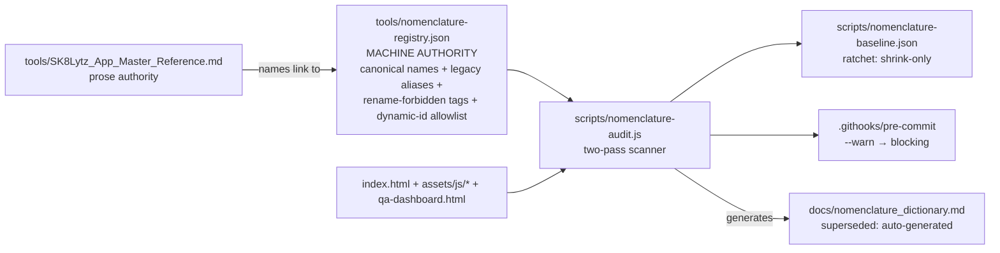

# ADR: Canonical Nomenclature Registry & Audit Engine

**Status:** Draft (whiteboard session 2026-07-17) · **Authors:** Neogleamz + Claude (Swarm Architect persona)
**Validation:** Drift Quantifier (Explore agent) + Security & Performance Validator (Plan agent) — both reports summarized in §3.

---

## 1. Context & Objectives

### Business problem
The SK8Lytz platform was built iteratively; hub tabs, panes, and buttons were renamed many times (Salez→ORDERZ, Nexl→NEXUZ, ProdBuilder→RECIPEZ, the Neogleamz→SK8Lytz brand shift itself). Renames were applied almost exclusively to the **user-visible label layer**, leaving every deeper layer stale. Consequences measured on 2026-07-17:

- Agents and humans mis-locate features (a test-guide agent placed the SKU Alias Manager in the wrong hub because internal names contradict labels).
- **3 dead buttons are live in production** (`click_sortLtvModal` ×6 headers, `click_cancelRestore`, `click_actualNetSort_a`) — tokens with no handler; silent-failure dispatch means nobody noticed.
- 87 ghost `getElementById` targets, several unguarded (latent `TypeError`s).
- 46 event-delegator orphans; ~100 unused CSS classes (est.); 24 localStorage keys across 4 legacy conventions (zero on `sk8lytz_`).
- Total drift: **LARGE (150+ hard findings)**, systemic across 4 of 6 hubs.

### Objectives
1. Establish a single, machine-readable **Canonical Nomenclature Registry** mapping every legacy term → current finalized name, per layer.
2. Build a deterministic scanner (`scripts/nomenclature-audit.js`) that validates the codebase against the registry on every commit — the same doctrine as `scripts/xss-audit.js` ("canonical scanner beats grep").
3. Remediate drift in risk-tiered batches; ratchet the scanner from advisory to blocking (mirroring the XSS gate lifecycle: advisory → zero findings → blocking on 2026-07-01).
4. Fix the discovered production bugs (dead buttons, unguarded ghosts) as immediate ledger items independent of the engine build.

### Scope
In: index.html, qa-dashboard.html, assets/js/*, CSS in `<style>` blocks, delegator tokens, localStorage keys, docs (Master Reference, nomenclature dictionary). Out: Supabase table/column renames (data layer is rename-forbidden by policy), git history rewriting.

### The five naming layers (drift model)
| Layer | Contents | Rename policy |
|---|---|---|
| L1 | Visible labels (tabs, headers, buttons) | Must always be canonical |
| L2 | DOM ids, CSS classes, `data-*` tokens | Document mapping; rename only with strong justification |
| L3 | Function/module names | Document mapping; rename only with strong justification |
| L4 | Supabase names, localStorage keys | **Rename-forbidden** without migration shim |
| L5 | Docs (Master Reference, dictionary, comments) | Must always be canonical; generated where possible |

---

## 2. Architectural Overview (Context Level)

- **Registry** (`tools/nomenclature-registry.json`): the single machine-readable naming authority. Holds: canonical L1 labels per hub/pane; legacy-alias history (`Salez→ORDERZ`, `Nexl→NEXUZ`, `neogleamz→sk8lytz`, `Salz→(retire)`, `Bridge→ORDERZ`, `ProdBuilder→RECIPEZ`, `ProdControl→BATCHEZ`, `ProdPrint→LAYERZ`…); **rename-forbidden tags** for DB-coupled and persistence-coupled identifiers; dynamic-id allowlist patterns (`paneSalez*`, `pipe-P-*`, `ldProp*`, `btnCompleteAssembly_*`).
- **Scanner** (`scripts/nomenclature-audit.js`): Node, zero new runtime deps, modeled on xss-audit.js conventions (WARN mode, report format, exit codes). Runs in pre-commit alongside xss-audit + version bump (budget confirmed: <1.5s of a 2–3s allowance).
- **Ecosystem fit:** findings flow into the Bucket List §🧹 Technical Debt via `/health_check`; remediation ships via `/bucketlist` batches; the advisory→blocking flip is a one-line hook change, same as the XSS gate's.

### Scanner checks
| ID | Check | Gate level |
|---|---|---|
| N1 | Ghost DOM lookups (three-way resolution: RESOLVED / PREFIX-MATCHED / UNRESOLVABLE) | Ratchet → blocking |
| N2 | Orphan delegator tokens, both directions (with variable-indirection collection) | Ratchet → blocking |
| N3 | L1 label drift vs registry (visible text ≠ canonical) | Blocking immediately (zero cases should exist post-Phase 1) |
| N4 | Legacy-term occurrences in **new/changed** lines (ratchet: baseline old, block new `Salez`/`Nexl`/`neogleamz`/… in code & comments) | Ratchet → blocking |
| N5 | localStorage key conformance (`sk8lytz_` for NEW keys only; legacy keys frozen, rename-forbidden) | Blocking for new keys |
| N6 | Unused CSS classes | **Advisory forever** (dynamic composition + print-window docs make zero-FP impossible) |
| N7 | Registry↔docs sync (dictionary is generated; Master Reference name tables match registry) | Blocking |

---

## 3. Industry Standard Validation (agent findings)

### Security & Performance (Validator: GO-WITH-CHANGES)
- Scanner is read-only fs, no network, no eval; only write path is `--update-baseline` behind an explicit flag. Registry JSON is publicly served (GitHub Pages) but contains only names already visible in shipped JS — no new exposure; keys/URLs stay out by rule.
- Measured xss-audit baseline: 0.115s over 2.37MB. Two-pass regex ≈ 0.3s; optional espree parse ≈ +0.3–1.0s. Within budget.
- Ratchet (baseline-and-block-new) is the established industry pattern (ESLint bulk suppressions, Betterer, ShellCheck baselines) and is this repo's own proven XSS-gate path. Baseline rules: line-number-independent fingerprints (`file|ruleId|identifier` — line numbers churn every commit via the auto version-bump), monotonic-shrink enforcement (scanner FAILS on stale baseline entries), regeneration only via `--update-baseline`.

### Vanilla JS & Data Flow — enumerated rename failure modes (why Tier 3 defaults to "document, don't rename")
| # | Failure mode | Evidence | Risk |
|---|---|---|---|
| FM-1 | Token suffixes encode Supabase enum values | `click_advancePrintStatus_Queued` (index.html:2344) → `advancePrintStatus('Queued')` (delegator:584); `getElementById('pipe-P-' + job.status)` (print-module.js:272) | HIGH |
| FM-2 | Runtime-composed ids | `'paneSalez' + paneId.charAt(0).toUpperCase()…` (index.html:5196); `tabId + '-tab'` (index.html:5148) | HIGH |
| FM-3 | Ids born inside template literals (155 interpolated-id sites) | `id="btnCompleteAssembly_${orderGroup.order_id}"` (packerz-module.js:409) | MED-HIGH |
| FM-4 | Persistence-coupled ids/keys | `neoSelect_${select.id}` (neogleamz-engine.js:1310) — renaming a select id silently wipes user prefs; `'layerzSopExpanded_' + grpId` | HIGH |
| FM-5 | Silent-failure dispatch (no `default:` in any delegator switch) | 3 dead buttons shipped unnoticed; `case 'click_switchTab_nexl'` still routes NEXUZ | HIGH |
| FM-6 | Tokens held in variables | `const cameraClickAction = 'click_openSOPSnapshotCamera_production'` (system-tools-module.js:2709) — naive orphan-kill would delete a live feature | MED |
| FM-7 | Print-window `document.write` payloads are separate documents | production-module.js:1054, packerz-module.js:966 et al. | MED |
| FM-8 | Automated renaming already failed here once | machine-mangled tokens `click_document_getElementById_paneFu` (delegator:674) | — |

### UI/UX Strategy
- Drift is user-harming today: dead sort headers/CANCEL button violate the 4-state UX doctrine (they present as interactive, do nothing). Fixing the 3 dead buttons + unguarded ghosts is Phase 0, independent of the engine.
- L1 labels are already consistent per hub (the renames "took" at the visible layer) — so the user experience of *names* is fine; the payoff of this engine is maintainability, agent accuracy, latent-crash removal, and bloat reduction, not visible relabeling.

---

## 4. Design Decisions & Trade-offs (ADR log)

| # | Decision | Alternatives rejected | Why |
|---|---|---|---|
| D1 | Registry JSON is the **single machine authority**; `docs/nomenclature_dictionary.md` becomes generated output; Master Reference links rather than restates | Keep maintaining prose dictionaries by hand | The dictionary is already provably stale (`invhub-tab` vs live `stockpilez-tab`) — unvalidated naming docs rot; N7 keeps the one authority honest |
| D2 | **Default = document, don't rename** for live L2/L3 identifiers; rename requires strong justification + scripted atomic rename + scanner-proven zero stragglers | Big-bang canonical rename of all internals | FM-1…FM-8: no compiler, string dispatch, DB/persistence coupling; repo history already contains one failed automated rename |
| D3 | Rename-forbidden tags for DB-coupled (`pipe-P-*`, `click_advancePrintStatus_*`, `st-*`) and persistence-coupled (`neoSelect_`/`neoResizer_` targets, all existing localStorage keys) names | Migration shims (read-old-write-new) | Shims allowed later case-by-case; forbidden-by-default is the safe posture for a solo-maintained live business tool |
| D4 | Scanner v1 = disciplined regex with three-way resolution; v2 graduates N1/N2 to espree AST if false positives persist (espree present transitively; pin explicitly in devDependencies if adopted) | AST-first; naive exact-match regex | Exact-match measured 94 false ghosts + ~36 false orphans — unacceptable; AST-first is over-engineering for v1 and regex matches xss-audit culture |
| D5 | Dynamic-id allowlist lives centrally in the registry, not as inline code annotations | `/* nomenclature-ok */` comments | index.html ships to every client; annotation bytes are bloat; central list is reviewable |
| D6 | N6 (unused CSS) is advisory forever | Blocking CSS check | DB-composed classes + print-window documents make zero false positives structurally impossible |
| D7 | Orphan/ghost deletions (Tier 2) require manual triage — a finding means "no static producer found," not "dead" | Auto-delete on scanner verdict | FM-6 proof: a naive pass would have deleted a live camera feature |
| D8 | Legacy localStorage keys are frozen (N5 governs new keys only) | Migrate all keys to `sk8lytz_` | Migration wipes user state for zero user value; not worth a shim for a solo-operator tool |
| D9 | Brand-term cleanup (`neogleamz`→`sk8lytz`, 88 refs) is its own Phase-4 epic, mostly comments/paths/keys — file renames (e.g. neogleamz-engine.js) need script-tag + cache-buster coordination | Bundle into Tier 1 | Touches script URLs (deploy-visible); deserves its own plan and test pass |

### Phased delivery plan (for /idea_intake)
- **Phase 0 — `fix/dead-ui-wiring` (P1, immediate):** fix 3 dead-button emissions + guard/remove the unguarded ghost lookups (`batchProductSelect` inventory-module.js:417, `packerzAdminRecipeSelect` ×5, `regex*` family, `backupModal`). These are live bugs found during recon, ship before/independent of the engine.
- **Phase 1 — `feat/nomenclature-registry`:** extract inventory (agent-assisted), user ratifies canonical names + rename-forbidden tags + allowlist; generate dictionary; Master Reference §sync.
- **Phase 2 — `feat/nomenclature-audit-engine`:** build scanner (N1–N7, three-way model, baseline mechanics); wire into pre-commit as `--warn`; baseline the LARGE backlog.
- **Phase 3 — `debt/nomenclature-remediation` (batched):** Tier 1 (docs/comments/labels) then triaged Tier 2 (43 orphan handlers, 87 ghosts, dead CSS) via `/bucketlist` parallel batches; baseline shrinks monotonically.
- **Phase 4 — `debt/brand-sweep` + blocking flip:** neogleamz→sk8lytz sweep (D9), then remove `--warn` from the hook once findings hit zero — same one-line flip as the XSS gate on 2026-07-01.
