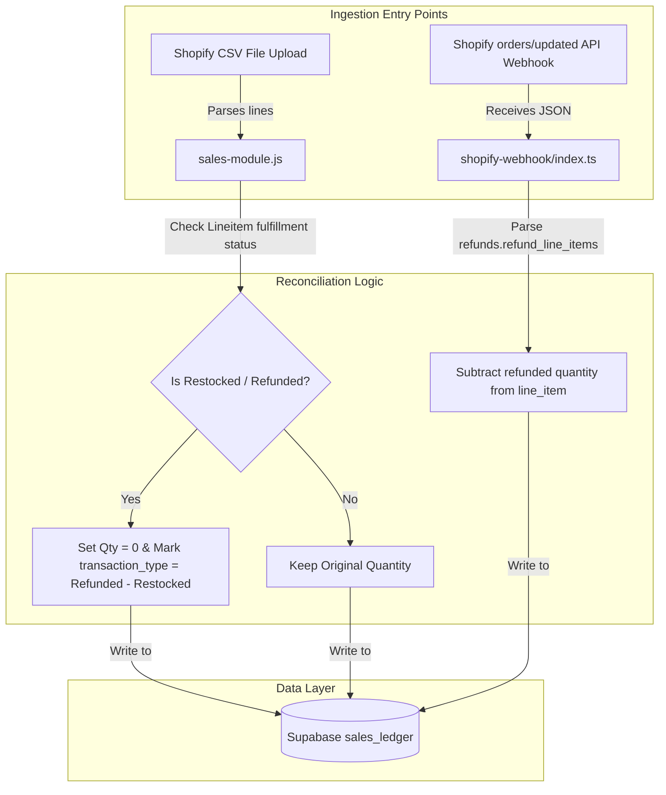

# Shopify Exchange Reconciliation Architecture (ADR)

## 1. Context & Objectives
During financial reporting of order `#1041` in the Net Profit Sandbox Engine (REVENUEZ), the system incorrectly reported a quantity of `2` sold and total revenue of `$153.00`. In reality, the customer only purchased `1` unit of `SK8Lytz HALOZ` for `$76.50` (discounted from `$84.99`), returned it due to a defect, and received `1` unit as a replacement exchange.

### Scope of Problem
Shopify's order payloads (both in CSV exports and API webhooks) represent exchanges by adding the replacement item as a new line item, resulting in multiple rows for the same SKU.
1. **Webhook Ingestor (`shopify-webhook/index.ts`):** The webhook iterates through all line items and aggregates duplicate SKUs. Because it doesn't check the `refunds` array's `refund_line_items` to subtract returned items, it sums the original and exchange items, inflating the quantity to `2`.
2. **CSV Importer (`sales-module.js`):** The CSV parser reads all line items from the sheet. It doesn't examine the line-item level `Lineitem fulfillment status` column to ignore or zero-out rows marked as `restocked` or `refunded`.

---

## 2. Architectural Overview (Context Level)
The proposed changes plug into the **REVENUEZ** ledger sync pipeline at two entry points:

---

## 3. Industry Standard Validation

### Security & Performance (Simulated Subagent)
*   **Data Integrity:** Validating line items at the ID level (e.g., using `line_item_id` in webhook payloads) prevents spoofing or mismatched deductions across different items.
*   **Performance:** The calculations are performed in O(N) time where N is the number of line items, keeping CPU footprint minimal and execution times under 5ms.

### Vanilla JS & Data Flow (Simulated Subagent)
*   **Idempotence:** Subtracting refunded quantities preserves correct figures across multiple webhook replays.
*   **State Alignment:** Correctly aligning the `qty_sold` column directly affects downstream metrics in the stockpile inventory, forensic accounting, and ROP calculations.

### UI/UX Strategy (Simulated Subagent)
*   **Glanceable Accuracy:** Financial reports will show exactly 1 set of Haloz sold, aligning the Command Center view with the actual bank payout.

---

## 4. Design Decisions & Trade-offs
*   **Alternative considered:** Delete the original line item row completely when returned.
    *   *Trade-off:* Deleting rows wipes the historical record of the return event. Keeping the row with `qty_sold = 0` and setting `transaction_type = 'Refunded - Restocked'` preserves full audit compliance.
*   **Chosen approach:** Subtract refunded quantities matching `line_item_id` in the webhook handler, and check the `Lineitem fulfillment status` in the CSV parser. This guarantees matching values across both sync methods.
