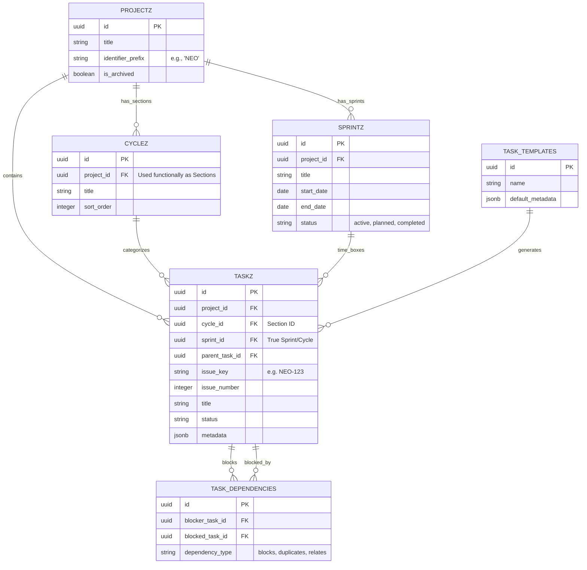

# Task Engine Evolution: Final Architecture Report

> [!NOTE]
> **Executive Summary:** This report synthesizes the competitive landscape and proposes a 100% pure Vanilla JS architectural evolution for the Neogleamz Task Engine. By bridging the gap between Asana's flexibility, Jira's visual structure, and Linear's speed, we unlock a massive capability upgrade without compromising our lightweight frontend topology. 🚀

## 🛠️ Feature Comparison Matrix

> [!IMPORTANT]
> The matrix below contrasts the existing Neogleamz Task Engine with three major industry competitors. It exposes the critical need for spatial visual mapping and temporal timeboxing.

| Feature Axis | 🎯 Asana | 🏗️ Jira | ⚡ Linear | 📦 Current Neogleamz Engine |
| :--- | :--- | :--- | :--- | :--- |
| **Core Philosophy** | Flexible list/board multi-homing | Highly structured agile workflows | Speed, keyboard-first, opinionated | Lightweight list-based hierarchy |
| **UI Paradigm** | Tabbed (List, Board, Timeline) | Complex issue screens, Kanban | Command K, hyper-fast lists | Single unified vertical list view |
| **Data Hierarchy** | Portfolio ➔ Project ➔ Section ➔ Task | Epic ➔ Sprint ➔ Story ➔ Subtask | Team ➔ Cycle ➔ Issue | Project ➔ Cycle (Section) ➔ Task |
| **Task Identification** | Hidden UUIDs (Link based) | Auto-increment Keys (ENG-123) | Auto-increment Keys (ENG-123) | Hidden UUIDs (`task.id`) |
| **Temporal Timeboxing** | Manual due dates | Sprints with Backlogs | Cycles with automated rollover | Missing (Cyclez hijacked for Sections) |
| **Dependencies** | Blocks / Blocked By UI | Complex multi-link types | Blocking / Blocked by | Exists in schema, missing in UI |

> [!WARNING]
> **Schema Desync Detected:** The current `cyclez` table acts as a vertical grouping (Sections), blocking the implementation of true Sprints. A new `sprintz` entity is required.

## 🧠 Database Architecture Integration (ERD)

> [!TIP]
> **Schema Evolution Strategy:** The following entity-relationship diagram maps out how the new proposed entities (`SPRINTZ`, `TASK_DEPENDENCIES`) natively integrate with our existing `taskz`, `cyclez`, and `task_templates` architecture.



## 📦 Pure Vanilla JS UX Topology (Kanban)

> [!IMPORTANT]
> The following layout rigorously follows our Dynamic 4-State UX rule (Loading, Error, Empty, Success). It exclusively uses responsive Flexbox logic (`vw`, `vh`, `clamp()`) and avoids all legacy frontend frameworks. Event handling must utilize `data-click` tokens bound to `system-event-delegator.js`.

```html
<!-- Kanban Module Wrapper -->
<div id="te-kanban-wrapper" class="te-board-layout" style="display: flex; flex-direction: column; height: 100%; overflow: hidden;">
    
    <!-- State 1: LOADING -->
    <div id="te-kanban-loading" style="display: flex; flex-direction: column; align-items: center; justify-content: center; height: 100%; width: 100%;">
        <div class="spinner" style="border: 4px solid rgba(255,255,255,0.1); border-top-color: var(--primary-color); border-radius: 50%; width: 40px; height: 40px; animation: spin 1s linear infinite;"></div>
        <span style="color: var(--text-muted); margin-top: 16px; font-weight: bold; letter-spacing: 1px;">SYNCING BOARD...</span>
    </div>

    <!-- State 2: ERROR -->
    <div id="te-kanban-error" style="display: none; flex-direction: column; align-items: center; justify-content: center; height: 100%; width: 100%;">
        <span style="font-size: 32px;">⚠️</span>
        <span style="color: var(--text-heading); margin-top: 8px; font-weight: bold;">Telemetry Desync</span>
        <button class="btn-orange-neon" data-click="click_teRetryKanban" style="margin-top: 16px;">REBOOT CONNECTION</button>
    </div>

    <!-- State 3: EMPTY -->
    <div id="te-kanban-empty" style="display: none; flex-direction: column; align-items: center; justify-content: center; height: 100%; width: 100%;">
        <span style="font-size: 32px;">📭</span>
        <span style="color: var(--text-heading); margin-top: 8px; font-weight: bold;">Zero Active Tasks</span>
        <span style="color: var(--text-muted); font-size: 12px; margin-top: 4px;">Initialize a new issue to populate this board.</span>
        <button class="btn-green-neon" data-click="click_teCreateNewTask" style="margin-top: 16px;">+ INITIALIZE TASK</button>
    </div>

    <!-- State 4: SUCCESS (Populated Kanban Matrix) -->
    <div id="te-kanban-success" style="display: none; flex-direction: row; align-items: stretch; gap: 16px; padding: 16px; height: 100%; overflow-x: auto; min-width: max-content;">
        
        <!-- Column Structural Template -->
        <div class="kanban-column" data-status="Todo" style="display: flex; flex-direction: column; width: clamp(280px, 20vw, 350px); background: rgba(255,255,255,0.02); border-radius: 8px; border: 1px solid rgba(255,255,255,0.05); max-height: 100%; flex-shrink: 0;">
            
            <!-- Column Header -->
            <div class="kanban-column-header" style="padding: 12px 16px; border-bottom: 1px solid rgba(255,255,255,0.05); display: flex; justify-content: space-between; align-items: center; position: sticky; top: 0; background: rgba(10, 10, 10, 0.9); z-index: 20;">
                <span style="color: var(--text-heading); font-weight: 900; font-size: 12px; letter-spacing: 1px;">TODO</span>
                <span class="kanban-count" style="background: rgba(255,255,255,0.1); padding: 2px 8px; border-radius: 12px; font-size: 10px; font-weight: bold; color: var(--text-muted);">0</span>
            </div>
            
            <!-- Sortable Body -->
            <div class="kanban-column-body te-sortable-board-list" data-status="Todo" style="padding: 12px; display: flex; flex-direction: column; gap: 12px; overflow-y: auto; flex-grow: 1; min-height: 50px;">
                <!-- Target for task injection via DOM manipulation -->
            </div>
            
            <!-- Column Footer -->
            <div class="kanban-column-footer" style="padding: 8px;">
                <button class="btn-blue-muted" style="width: 100%; text-align: left; padding: 8px 12px; display: flex; align-items: center; gap: 8px; font-size: 12px;" data-click="click_teInlineKanbanAdd" data-status="Todo">
                    <span style="font-weight: bold; font-size: 14px;">+</span> Add Task
                </button>
            </div>
        </div>
        
    </div>
</div>
```

> [!TIP]
> **DOM Manipulation Note:** The `.te-sortable-board-list` class serves as the bind point for SortableJS. All drag-and-drop actions must utilize pure JS event delegation and issue immediate background state updates to the Database. No explicit `onclick` attributes or inline scripting is allowed within the injected HTML.
