# Canonical Nomenclature Dictionary

### Canonical Nomenclature Dictionary
| UI Tab Label (Found) | DOM ID (Legacy) | Canonical Name (Mandated) | Associated JS Modules |
| --- | --- | --- | --- |
| 📊 STOCKPILEZ | `invhub-tab` | **STOCKPILEZ** | `inventory-module.js`, `bom-module.js` |
| 🏭 MAKERZ | `prodhub-tab` | **MAKERZ** | `production-module.js`, `barcodz-module.js` |
| 📦 FULFILLZ | `fulfillzhub-tab` | **FULFILLZ** | `packerz-module.js`, `print-module.js`, `labelz-module.js` |
| 🛒 REVENUEZ | `salezhub-tab` | **REVENUEZ** | `sales-module.js`, `ceo-module.js` |
| 👥 SOCIALZ | `socialzhub-tab` | **SOCIALZ** | `socialz-module.js` |
| ⚡ NEXUZ | `synchub-tab` | **NEXL** | `system-tools-module.js`, `task-engine.js` |

### Architectural Hierarchy Diagram

```mermaid
graph TD
    App[index.html SPA]
    
    %% Hubs Layer
    App --> Stockpilez[STOCKPILEZ Hub<br>DOM: invhub-tab]
    App --> Makerz[MAKERZ Hub<br>DOM: prodhub-tab]
    App --> Fulfillz[FULFILLZ Hub<br>DOM: fulfillzhub-tab]
    App --> Revenuez[REVENUEZ Hub<br>DOM: salezhub-tab]
    App --> Socialz[SOCIALZ Hub<br>DOM: socialzhub-tab]
    App --> Nexl[NEXL Hub<br>DOM: synchub-tab]

    %% Example Modules Layer
    Stockpilez -.-> InventoryModule[inventory-module.js]
    Stockpilez -.-> BomModule[bom-module.js]
    
    Makerz -.-> ProductionModule[production-module.js]
    Makerz -.-> BarcodzModule[barcodz-module.js]
    
    Fulfillz -.-> PackerzModule[packerz-module.js]
    Fulfillz -.-> PrintModule[print-module.js]
    Fulfillz -.-> LabelzModule[labelz-module.js]

    Revenuez -.-> SalesModule[sales-module.js]
    Revenuez -.-> CeoModule[ceo-module.js]

    Socialz -.-> SocialzModule[socialz-module.js]

    Nexl -.-> SystemToolsModule[system-tools-module.js]
    Nexl -.-> TaskEngine[task-engine.js]
    
    %% Core Engines
    Core[Core Engines]
    App --> Core
    Core -.-> NeogleamzEngine[neogleamz-engine.js]
    Core -.-> EventDelegator[system-event-delegator.js]
    Core -.-> ScraperModule[scraper-module.js]
    Core -.-> AnalyticsModule[analytics-module.js]
    
    %% Global Modals (Grouped for simplicity)
    Modals[Global Overlay Modals]
    App --> Modals
    Modals -.-> SOP[SOP Master/Viewer]
    Modals -.-> Recipe[Recipe Manager]
    Modals -.-> Data[Actual Net / Analytics / Task Planner]
```

