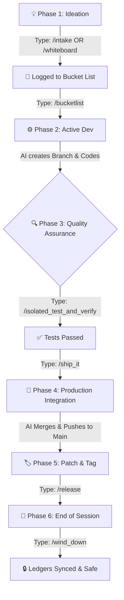

# ⚡ SK8Lytz A.I. Command & Rules Cheat Sheet

Welcome to your customized Neogleamz / SK8Lytz Autonomous Agent protocol directory! This document systematically outlines every single Slash Command workflow, AI Persona prompt, and Core Directive the A.I. uses to maintain the integrity of your codebase.

---

## 🗺️ The Perfect Workflow (Idea to Deployment)
If you want to perform a flawless, end-to-end code change, follow this sequence:

---
## 🛠️ Direct Workflow Commands (IDE Auto-Suggested)
You can access these official macros via the IDE's `/` pop-up menu. They execute structured, multi-step Standard Operating Procedures.

### 🚀 1. Project Management & Deployment
* **`/bucketlist`** — **(The Project Engine)** Automates branching, planning, execution, and documentation for the highest priority item on the Bucket List.
* **`/status_update`** — **(Project SITREP)** Generates a highly detailed Situation Report based on current Git context, modified files, and the active Bucket List target.
* **`/ship_it`** — **(The Merge Protocol)** Executes the code audit, documentation check, and git merge sequence to safely finalize a feature branch into `main`.
* **`/release`** — **(Release Manager)** Executes the semantic version bump, automates the `CHANGELOG.md` generation, and pushes an official Git Tag to GitHub.

### 🛡️ 2. Diagnostics, QA & Code Maintenance
* **`/health_check`** — **(Technical Debt Janitor)** Scans the codebase for vulnerabilities and technical debt, triaging the findings cleanly into the backlog.
* **`/isolated_test_and_verify`** — **(Strict QA Flow)** Executes a rigorous QA checklist locally on 127.0.0.1:5500 to natively verify recent UI/Bluetooth/DB changes.
* **`/gitcleanup`** — **(Local Storage Maintenance)** Safely parses and prunes local Git branches (`feat/`, `fix/`) that have already been securely merged.
* **`/legacy_audit`** — **(Code Refactoring)** Executes a strict code audit to modernize old files up to current Vanilla JS standards.

### 🚨 3. Emergency Operations & Rollbacks
* **`/bug_hunter`** — A strict diagnostic workflow for analyzing stack traces, formulating theories, and awaiting authorization before writing code.
* **`/debug_drill`** — A strict workflow that forces the AI to instrument code with `console.log` traps and form theories before attempting to guess-fix a bug.
* **`/panic_button`** — **(Lockdown)** Triggers a strict read-only diagnostic mode for when the application is catastrophically broken but the source is unknown.
* **`/save-point`** — **(Timeline Protection)** Executes safety checkpoints, temporary stash saves, or destructive rollbacks to protect the codebase from rabbit holes and broken states.
* **`/wind_down`** — **(End of Session Protocol)** Executes the end-of-session synchronization, workspace sanitization, and state saving sequence.

### 🧠 4. Specialized A.I. Personas
* **`/simulate_ux`** — Triggers a persona shift to a Novice/Customer user to evaluate Desktop web UI and Physical usability constraints.
* **`/devils_advocate`** — Engages a contrarian logic sequence to stress-test ideas and identify production flaws before planning begins.

---

## 🕵️ Hidden Skill Commands (Natural Language Triggers)
These commands will not show up in the IDE auto-suggest menu, but the A.I. inherently listens for them 24/7. You can type them directly into chat at any time.

### 💡 1. Ideation & Intake
* **`/intake`** or **`/zero_bypass`** — Captures your raw ideas and formats them into the Bucket List. Supports background passive logging OR instant branch checkout via the Priority Override.
* **`/whiteboard`** or **`/brainstorm`** — Explicitly commands the AI to stop coding and execute pure conversational architectural brainstorming.
* **`/product_alignment`** or **`/vet_idea`** — Forces the AI to audit a brainstormed feature strictly against the "Product Bible" & Anti-Goals before allowing it on the backlog.
* **`/dependency_diet`** — Audits the application to aggressively prune bloated 3rd party plugins.

### 🎓 2. Engineering & Learning
* **`/tdd`** or **`/test_driven`** — Forces the AI to write an automated test suite *before* writing the logic feature.
* **`/rubber_duck`** or **`/eli5`** — Triggers a learning mode where the AI natively explains a complex bug or architecture "like you're 5".
* **`/jargon_brake`** or **`/slow_down`** — A panic button mid-conversation forcing the AI to drop the engineering speak and explain what is happening simply.
* **`/echo`** or **`/playback`** — Forces the AI to repeat your complex logical parameters back to you mathematically to ensure it is not hallucinating before it writes code.

### ⚙️ 3. Administrative Automation
* **`/sync_db`** or **`/supabase_sync`** — Automatically documents any new Database Schema or RLS modifications natively into the Master Reference file.
* **`/evolve`** or **`/meta_evolution`** — A self-updating mechanism that allows you to instruct the AI to dynamically spawn or rewrite one of its own Agent Rule files based on a mistake it just made.

---

## 📜 Core A.I. Governance Directives (Categorized)
Every single time the A.I. types a response, it is secretly subjected to the following deep-dive structural rules.

### 🛡️ 1. Complete Safety & Security Enforcements
* **Critical Safety Protocol:** The `main` branch is hyper-protected. The A.I. is permanently locked out of reading or modifying `.git/hooks/`. Furthermore, it must possess "Passphrase Amnesia" — never caching or reusing your authentication keys across boundaries.
* **Security & Secrets Standard:** The A.I. must use strict `.env.example` placeholders. It is strictly forbidden from hardcoding API keys, passwords, Database URIs, or hardware MAC addresses directly into the JS codebase or reading your actual local `.env` keys.
* **Local Tool Enforcement Rule:** The A.I. is globally blocked from using destructive Native Terminal commands like `sed`, `awk`, or `cat >>`. It must utilize its specialized contextual API tools (`write_to_file`, `replace_file_content`) to prevent silent bash errors from overwriting source code.
* **Anti-Hallucination Protocol:** Whenever diagnosing a complex defect, the A.I. cannot execute generic assumptions. It MUST use First-Principle tracing (cross-referencing the `SK8Lytz_App_Master_Reference.md`), explicitly cite findings, show byte-matrix math visibly in chat, and explicitly state when it enters "Discovery Mode".

### ⚙️ 2. Pure Browser DOM Engineering Constraints
* **Web Native Exclusivity Rule:** Absolutely no Mobile, Desktop, or Node.js logic is permitted. Everything runs natively in Vanilla standard browsers. Storage is isolated to Local/Session Storage or Supabase. Hardware must use `navigator.bluetooth` explicitly.
* **Vanilla DOM Mastery:** React hooks (`useState`), Vue abstractions, and jQuery are strictly banned. It must attach interactions exclusively using native `element.addEventListener` and efficiently build HTML string injection fragments to update views.
* **Coding Standards & Clean Code:** Strict Single Responsibility pattern enforcement. If a function is > 50 lines, it must be modularized. Enforces strict Async/Await try/catch block error handling that actively bubbles errors to the visual UI rather than silently swallowing them in the console.

### 🎨 3. Flawless UI/UX Architecture
* **Modern UI/UX Protocol:** The A.I. must adhere to a rigorous 4-State Matrix (`Loading`, `Error`, `Empty`, `Success`) for every element, toggled via Vanilla class injection. Must use strict CSS 8-point typographic grids and 48px tap targets for mobile usability.
* **Context-Aware Responsive UI Framework:** The A.I. executes dual strategies: Data-dense `Desktop-First` layouts for internal Executive views, and high-contrast, bottom-anchored `Mobile-First` logic for customer hardware remotes. 
* **Chart.js Rendering Rule:** The A.I. must explicitly enforce a Destruction Mandate (`chart.destroy()`) before attempting to render any new graphic context, preventing the "ghosting" memory-leak collision bug.

### 📝 4. Continuous Execution & Cleanup Standards
* **Semantic Commits Enforcer (24/7):** The A.I. executes mandatory micro-commits following any logic change to protect states. It natively structures the commit (`feat:`, `fix:`, `perf:`, `chore:`) to ensure downstream operations like `cut_release` parse beautifully.
* **Boy Scout Protocol:** When targeting standard functions, the A.I. is ordered to find and isolate *exactly one* piece of messy technical debt (e.g. an orphaned `var` namespace or dangling event listener) and eradicate it.
* **Surgical Strike Protocol (Anti-Collision):** To avoid erasing critical code in monolithic documents, the A.I. executes highly-targeted micro-edits. It is fundamentally required to execute a `git diff HEAD` immediately after touching a document to self-audit whether it accidentally erased unrelated elements.
* **Local State Caching Rule:** The A.I. must exclusively serialize UI data using the explicit `sk8lytz_` namespace string to prevent collision, and maintain synchronous localized preferences.
* **Corporate Memory Synchronization:** When injecting facts into the Master Reference file, it must be contextually chunked, and the AI must actively prune older, incorrect architectural assumptions down natively rather than continually appending lines at the bottom of the list.
