# 📘 SK8Lytz App Master Reference

This is the Canonical Source of Truth. This document must be consulted before making architectural assumptions or database modifications.

---

## 📖 0. Official Nomenclature Dictionary

### Canonical Nomenclature Dictionary
| UI Tab Label (Found) | DOM ID (Legacy) | Canonical Name (Mandated) | Associated JS Modules |
| --- | --- | --- | --- |
| 📊 STOCKPILEZ | `invhub-tab` | **STOCKPILEZ** | `inventory-module.js`, `bom-module.js` |
| 🏭 MAKERZ | `prodhub-tab` | **MAKERZ** | `production-module.js`, `barcodz-module.js` |
| 📦 FULFILLZ | `fulfillzhub-tab` | **FULFILLZ** | `packerz-module.js`, `print-module.js`, `labelz-module.js` |
| 🛒 REVENUEZ | `salezhub-tab` | **REVENUEZ** | `sales-module.js`, `ceo-module.js` |
| 👥 SOCIALZ | `socialzhub-tab` | **SOCIALZ** | `socialz-module.js` |
| ⚡ NEXUZ | `synchub-tab` | **NEXUZ** | `system-tools-module.js`, `task-engine.js` |

### Architectural Hierarchy Blueprint (IMMUTABLE)
> **CRITICAL DIRECTIVE:** The following Mermaid topology is the mathematically isolated, canonical map of the entire Neogleamz ecosystem. EVERY SINGLE actionable modal, toggle, or UI flow must be explicitly mapped here. If you are tasked with creating, moving, or deleting a UI element, you MUST update this dictionary.

```mermaid
graph LR
    classDef sharedSop fill:#3b82f6,color:#fff,stroke:#2563eb;
    classDef sharedArchive fill:#f97316,color:#fff,stroke:#ea580c;
    classDef sharedPaper fill:#a855f7,color:#fff,stroke:#9333ea;
    classDef sharedPrint fill:#10b981,color:#fff,stroke:#059669;
    classDef sharedEstimator fill:#eab308,color:#000,stroke:#ca8a04;

    subgraph Global [Global Header Triggers]
        TipzModal[TIPZ Modal<br>Btn: 💡 TIPZ]
        TaskzModal[TASKZ Modal<br>Btn: 🎯 TASKZ] -.-> TaskzBoardActions[Kanban & Task Actions<br>Btns: Create, Archive, Status...]
    end
    
    subgraph H1 [STOCKPILEZ HUB Architecture]
        Stockpilez[STOCKPILEZ Hub<br>DOM: stockpilez-tab] -.-> SP_Inventory[STOCKZ Pane<br>DOM: paneInventory]
        Stockpilez -.-> SP_Pipeline[DATAZ Pane<br>DOM: panePipeline]
        Stockpilez -.-> SP_Simple[EDITZ Pane<br>DOM: paneSimple]
        
        SP_Inventory --> SnapshotManagerModal[Snapshot Manager Modal<br>Btn: 🗂️ SNAPSHOTS]
        SP_Inventory --> CycleCountManagerModal[Cycle Count Manager Modal<br>Btn: 🔄 CYCLE COUNTS]
        SP_Inventory --> VelocityzModal[Map Unknown SKU Modal<br>Btn: ⏳ VELOCITYZ]
        SP_Inventory --> GlobalLeadModal[Global Lead Editor Modal<br>Btn: ✏️ EDIT GLOBAL LEAD]
        SP_Inventory --> LowStockzReport[Low Stockz Report Trigger<br>Btn: 📉 LOW STOCKZ REPORT]
        SP_Inventory --> ResetStockLevels[Reset Stock Levels Trigger<br>Btn: ⚠️ RESET STOCK LEVELS]
        
        SP_Simple --> EditzAutoFill[Auto-Fill Ledger Action<br>Btn: Auto-Fill Ledger]
        SP_Simple --> EditzBulkModal[EDITZ BULK STAGING Modal<br>Btn: Bulk Edit]
        SP_Simple --> EditzAddRow[Add Manual Row Action<br>Btn: + Add Row]
    end
    
    subgraph H2 [MAKERZ HUB Architecture]
        Makerz[MAKERZ Hub<br>DOM: makerz-tab] -.-> MK_Builder[RECIPEZ Pane<br>DOM: paneProdBuilder]
        Makerz -.-> MK_Control[BATCHEZ Pane<br>DOM: paneProdControl]
        Makerz -.-> MK_Print[LAYERZ Pane<br>DOM: paneProdPrint]
        
        MK_Builder --> RecipeModal[Recipe Action Modal<br>Btn: + CREATE]
        MK_Builder --> RecipeManagerModal[RECIPE MANAGER STAGING Modal<br>Btn: 🛠️ MANAGER]
        MK_Builder --> BulkAddModal[Bulk Add Modal<br>Btn: BULK ADD]
        MK_Builder --> RecipeAddPart[Add BOM Part Action<br>Btn: Add Part]
        MK_Builder --> RecipeFixPredictions[Apply All Suggestions Action<br>Btn: FIX ALL PREDICTIONS]
        MK_Builder --> RecipeCommitFixes[Commit Manager Fixes Action<br>Btn: COMMIT FIXES]
        
        MK_Control --> NewWOModal[Start Production Batch Modal<br>Btn: + CreateBatch]
        MK_Control --> MultiBatchModal[🌍 SHARED: Batch Estimator Modal<br>Btn: + BatchOrder]
        MK_Control --> SOPMasterModal_Prod[🌍 SHARED: SOP Editor Modal<br>Btn: BATCHEZ SOP EDITOR]
        MK_Control --> DraftScrapModal[Draft Scrap Modal<br>Btn: Update Scrap Tally]
        MK_Control --> ArchiveExplorerModal_Bat[🌍 SHARED: Archive Explorer Modal<br>Btn: 🗄️ Archives]
        MK_Control --> BatchezPrintSOP[🌍 SHARED: Print SOP Modal<br>Btn: 🖨️ Print SOP]
        MK_Control --> BatchezPickList[Pick List Print Configuration<br>Btn: 🖨️ Print List]
        MK_Control --> BatchezSOPEditorModal[🌍 SHARED: SOP Editor Modal<br>Btn: 🔒 EDIT]
        MK_Control --> BatchezDeleteWO[Delete Work Order Action<br>Btn: DELETE]
        MK_Control --> BatchezStatusActions[Workflow Status Advance Actions<br>Btns: Queued, Picking, Production, Finalize]
        MK_Control --> BatchezSaveInline[Save SOP Changes Action<br>Btn: Save Changes to Cloud]
        MK_Control --> BatchezStageItem[Stage Batch Item Action<br>Btn: + Add]
        MK_Control --> BatchezValidateCreate[Validate & Create WO Action<br>Btn: Verify Inventory & Create]
        MK_Control --> BatchezGenProjection[Generate Projection Action<br>Btn: Generate Master Projection]
        MK_Control --> BatchezPrintReport[Print Batch Report Action<br>Btn: Print Report]
        MK_Control --> BatchezSaveBlueprint[Save Master SOP Action<br>Btn: SAVE MASTER BLUEPRINT]
        MK_Control --> BatchezClearArchive[Delete All Archives Action<br>Btn: Clear Archive]
        
        MK_Print --> ManualPrintModal[Manual Print Modal<br>Btn: + PRINTBATCH]
        MK_Print --> MultiBatchModal_3d[🌍 SHARED: Batch Estimator Modal<br>Btn: + BatchOrder]
        MK_Print --> SOPMasterModal_Print[🌍 SHARED: SOP Editor Modal<br>Btn: LAYERZ SOP EDITOR]
        MK_Print --> ArchiveExplorerModal_Lay[🌍 SHARED: Archive Explorer Modal<br>Btn: 🗄️ Archives]
        MK_Print --> LayerzSOPEditorModal[🌍 SHARED: SOP Editor Modal<br>Btn: 🔒 EDIT]
        MK_Print --> LayerzPrintSOPModal[🌍 SHARED: Print SOP Modal<br>Btn: 🖨️ PRINT]
        MK_Print --> LayerzDeletePrint[Delete Print Job Action<br>Btn: DELETE]
        MK_Print --> LayerzStatusActions[Workflow Status Advance Actions<br>Btns: Queued, Printing, Cleaned, Finalize]
        MK_Print --> LayerzRecordYield[Record Run Yield Action<br>Btn: Record Yield & Stop Timer]
        MK_Print --> LayerzFinalizePrint[Submit Finalize Print Action<br>Btn: Complete & Log]
    end
    
    subgraph H3 [FULFILLZ HUB Architecture]
        Fulfillz[FULFILLZ Hub<br>DOM: fulfillz-tab] -.-> FZ_Packerz[PACKERZ Pane<br>DOM: paneFulfillzPackerz]
        Fulfillz -.-> FZ_Barcodz[BARCODZ Pane<br>DOM: paneFulfillzBarcodz]
        Fulfillz -.-> FZ_Labelz[LABELZ Pane<br>DOM: paneFulfillzLabelz]
        
        FZ_Packerz --> SOPMasterModal_Pack[🌍 SHARED: SOP Editor Modal<br>Btn: PACKERZ SOP EDITOR]
        FZ_Packerz --> PackerzArchiveModal[🌍 SHARED: Archive Explorer Modal<br>Btn: 🗄️ Archives]
        FZ_Packerz --> PackerzPrintSOP[🌍 SHARED: Print SOP Modal<br>Btn: Print SOP]
        FZ_Packerz --> PackerzEditSOP[🌍 SHARED: SOP Editor Modal<br>Btn: EDIT]
        FZ_Packerz --> PackerzSignoffQA[Signoff QA Action<br>Btn: COMPLETE QA CHECKS]
        FZ_Packerz --> PackerzViewPDF[View PDF Media Action<br>Btn: 📄 View PDF]
        FZ_Packerz --> PackerzPlayVideo[Play Video Media Action<br>Btn: 🎥 Play Video]
        
        FZ_Barcodz --> PaperSettingsModal_Bar[🌍 SHARED: Paper Profile Modal<br>Btn: ⚙️ PAPER SETTINGS]
        FZ_Barcodz --> PrintBatchModal_Bar[🌍 SHARED: Execute Batch Print<br>Btn: 🖨️ PRINT BATCH]
        
        FZ_Labelz --> CreateLabelModal[Create Label Modal<br>Btn: + NEW LABEL]
        FZ_Labelz --> PaperSettingsModal_Lab[🌍 SHARED: Paper Profile Modal<br>Btn: ⚙️ PAPER SETTINGS]
        FZ_Labelz --> PrintBatchModal_Lab[🌍 SHARED: Execute Batch Print<br>Btn: 🖨️ PRINT BATCH]
        FZ_Labelz --> LabelDesignerToolbar[Designer Canvas Actions<br>Btns: Text, Image, Shape, Undo, Save...]
    end
    
    subgraph H4 [REVENUEZ HUB Architecture]
        Revenuez[REVENUEZ Hub<br>DOM: revenuez-tab] -.-> RV_Bridge[ORDERZ Pane<br>DOM: paneSalezBridge]
        Revenuez -.-> RV_Analyticz[STATZ Pane<br>DOM: paneSalezAnalyticz]
        Revenuez -.-> RV_Commandz[SIMULATORZ Pane<br>DOM: paneSalezCommandz]
        
        RV_Bridge --> ActualNetModal[Actual Net Breakdown Modal<br>Btn: ACTUAL NET]
        RV_Bridge --> MathSimulatorModal[Sandbox Math Simulator Modal<br>Btn: SANDBOX NET]
        
        RV_Commandz --> CeoAddModal[CEO Terminal Modal<br>Btn: +PRODUCT ANALYSIS]
        RV_Commandz --> LtvModal[Cohort Intelligence Modal<br>Btn: LTV]
    end
    
    subgraph H5 [SOCIALZ HUB Architecture]
        Socialz[SOCIALZ Hub<br>DOM: socialz-tab] -.-> SZ_Roster[ROSTER Pane<br>DOM: paneSocialzRoster]
        
        SZ_Roster --> SkaterModal[Profile Information Modal<br>Btn: Open Skater]
        SZ_Roster --> AnalyticsDashboardModal[Analytics Dashboard Modal<br>Btn: 📊 Analytics]
        SZ_Roster --> RosterImport[Import Roster Action<br>Btn: Import]
        SZ_Roster --> RosterExport[Export Roster Action<br>Btn: Export]
        SZ_Roster --> RosterMigrateAvatars[Migrate Avatars Action<br>Btn: Migrate Avatars]
        SZ_Roster --> RosterAddSkater[Add Skater Action<br>Btn: Add Skater]
        SZ_Roster --> RosterViewToggles[View Toggles<br>Btns: Grid, Row, Sort...]
    end
    
    subgraph H6 [NEXUZ HUB Architecture]
        Nexuz[NEXUZ Hub<br>DOM: nexuz-tab] -.-> NX_Importz[IMPORTZ Pane<br>DOM: paneNexlImportz]
        Nexuz -.-> NX_Salez[SALEZ Pane<br>DOM: paneNexlSalez]
        Nexuz -.-> NX_Brainz[BRAINZ Pane<br>DOM: paneNexlBrainz]
        
        NX_Importz --> ParserConfigModal[Parser Config Modal<br>Btn: ⚙️ PARSER CONFIG]
        NX_Importz --> ParcelConfigModal[Parcel Config Modal<br>Btn: ⚙️ PARCEL CONFIG]
        NX_Importz --> ImportzOrder[Import Superbuy Orders<br>Btn: IMPORT ORDERs]
        NX_Importz --> ImportzOrderTest[Ingest Test Sandbox<br>Btn: INGEST TEST FILE]
        NX_Importz --> ImportzParcel[Import Superbuy Parcels<br>Btn: IMPORT PARCELs]
        NX_Importz --> ImportzParcelTest[Ingest Test Sandbox<br>Btn: INGEST TEST FILE]
        
        NX_Salez --> AliasModal[Alias Modal<br>Btn: + ADD NEW]
        NX_Salez --> SalezImportSales[Import Sales CSV<br>Btn: IMPORT SALEZ CSV]
        NX_Salez --> SalezImportSalesTest[Ingest Test Sandbox<br>Btn: INGEST TEST FILE]
        NX_Salez --> SalezBackfillSales[Backfill Sales Financials<br>Btn: BACKFILL]
        NX_Salez --> SalezGuide[Show Guide Alert<br>Btn: GUIDE]
        NX_Salez --> SalezImportBilling[Import Billing CSV<br>Btn: IMPORT BILLING CSV]
        NX_Salez --> SalezImportBillingTest[Ingest Test Sandbox<br>Btn: INGEST TEST FILE]
        NX_Salez --> SalezBackfillBilling[Backfill Billing Financials<br>Btn: BACKFILL]
        
        NX_Brainz --> ScraperFoundryModal[Scraper Foundry Modal<br>Btn: 🚀 LAUNCH SCRAPER]
        NX_Brainz --> BrainzExport[Export DB Vault Backup<br>Btn: EXPORT BACKUP]
        NX_Brainz --> BrainzImport[Import DB Vault Backup<br>Btn: IMPORT BACKUP FILE]
        NX_Brainz --> BrainzInspectTest[Inspect Test Backup<br>Btn: INSPECT TEST FILE]
        NX_Brainz --> BrainzRestore[Execute Live Restore<br>Btn: LIVE RESTORE]
        NX_Brainz --> BrainzExactCalc[Force DB Recalculation<br>Btn: EXACT CALC]
        NX_Brainz --> BrainzGuide[Show Guide Alert<br>Btn: READ GUIDE]
    end

    class SOPMasterModal_Prod,SOPMasterModal_Print,SOPMasterModal_Pack,BatchezSOPEditorModal,LayerzSOPEditorModal,PackerzEditSOP sharedSop;
    class ArchiveExplorerModal_Bat,ArchiveExplorerModal_Lay,PackerzArchiveModal sharedArchive;
    class PaperSettingsModal_Bar,PaperSettingsModal_Lab sharedPaper;
    class PrintBatchModal_Bar,PrintBatchModal_Lab,BatchezPrintSOP,LayerzPrintSOPModal,PackerzPrintSOP sharedPrint;
    class MultiBatchModal,MultiBatchModal_3d sharedEstimator;
```



---

## 🏛️ 1. Project Architecture (Vanilla JS)
* **Zero-Build Stack:** This application is entirely built on Vanilla HTML, CSS, and JS. There is NO Node.js build step, NO Webpack, and NO TypeScript.
* **Component Location:** There is no `src/` directory. All core JavaScript modules live directly in the Root Directory.
  * e.g., `inventory-module.js`, `ceo-module.js`, `production-module.js`, `sales-module.js`, etc.

### ESLint & Global Namespace Boundary
* **No-Undef Rule:** Because we use a `<script>` tag-based architecture, any functions or variables declared in the global scope of a `.js` file become implicitly available on the `window` object.
* **The Registration Mandate:** To maintain a strict boundary and prevent `no-undef` warnings, **ANY new cross-file global function or variable created must be manually registered in `eslint.config.mjs` under the `languageOptions.globals` object.** ESLint parses each file independently, so it requires this explicit dictionary to understand our architecture.

### Dynamic Event Delegation
* **Global Interaction Controller**: Rather than inline DOM handlers (`onclick="..."`) scattered throughout the HTML, the application utilizes a centralized, native `system-event-delegator.js`.
* **Action Tokens**: All interactive elements MUST be tagged with native data attributes like `data-click`, `data-change`, or `data-input` containing specific string tokens (e.g., `data-click="closeModal"`).
* **The Intercept**: The delegator bounds to `document.body` and natively catches all bubbled interactions. It maps the `data-*` tokens directly to legacy functions within standard `switch()` matrices, providing maximum DOM performance and mitigating memory leaks.

### Sitewide Real-Time Synchronization (Zero-Cache Protocol)
* **Global Websocket Channel**: `system-realtime-sync.js` initializes a global Supabase Realtime channel (`neogleamz-global-sync`) listening to all exposed PostgreSQL tables for `INSERT`, `UPDATE`, and `DELETE` payloads.
* **Active Focus Guard**: To prevent the UI from aggressively re-rendering while the user is actively typing, the sync module monitors standard DOM focus events (`input`, `textarea`, `[contenteditable]`). If focused, updates are buffered; once blurred, the accumulated payload is processed and the DOM is repainted.
* **In-Memory Caches**: Rather than triggering massive `fetch()` sweeps, real-time broadcasts inject or modify the targeted object directly inside the global state arrays (e.g., `taskEngineDB`, `productionDB`) before calling the contextual `render()` function.

### DOM Security & Injection (safeHTML)
* **The safeHTML Protocol**: All dynamically generated HTML strings injected via `.innerHTML`, `.insertAdjacentHTML()`, or iframe/window `document.write()` containing dynamic variables MUST be wrapped in `window.safeHTML(string)`. This relies on DOMPurify to strip away XSS vectors.
* **Inline Handlers Scrubbed**: `DOMPurify` will violently scrub all inline JavaScript execution attributes (`onclick`, `onchange`, `ondragstart`, etc.) from HTML strings.
* **The Solution**: When generating complex dynamic DOM elements (like lists or SOP groups), you MUST assign explicit CSS classes or `data-*` attributes within the template string. Immediately following the dynamic element injection, you MUST natively attach event handlers via `querySelectorAll` and `addEventListener()`. Relying on inline string execution will result in dead UI components.

### Local State Caching Matrix
* **Synchronous Speed Priority**: `localStorage` is used exclusively for global toggles, persistent states, and zero-latency configs.
* **Storage Keys**:
  * `neogleamz_default_lead_time`: Sets the global fallback ROP lead time (in days) if a raw good does not have a unique one set.
---

## 🎨 2. UI & Front-End Architecture Standards
The CSS system is hardcoded into the massive `index.html` style block using native CSS Variables.

### A. The Z-Index Authority Hierarchy
* **0-1**: Base DOM Elements
* **10**: Drag Resizers (`.h-resizer`, `.v-resizer`)
* **20**: Sticky Table Headers (`<th>`)
* **50**: Custom `.pane-header-bar`
* **500**: Custom Dropdown Panels (Multi-Select wrappers)
* **10000+**: `.modal-overlay` wrappers (Ensures Modals ALWAYS win over dropsdowns)

### B. Global Action Button Matrix
Buttons follow a 3-intensity system (Muted, Standard/Ghost, Neon). Use the following semantic colors and intensity suffixes to maintain UI coherence:

**Color Semantics:**
* **🟢 Green**: Positive commits, saves, submits, creations.
* **🔴 Red**: Destructive actions, resets, closes, deletes.
* **🟠 Orange / Brand**: Inline properties, editing modes, and configuration tools.
* **🔵 Blue / Slate**: Neutral tools, nav, safe auxiliary tasks.

**The 3-Intensity Bordered System:**
* **Neon (`.btn-[color]-neon`)**: Highest priority. Solid vibrant background. Use for primary call-to-actions (e.g. `btn-green-neon` for "Save Profile").
* **Standard Ghost (`.btn-[color]`)**: Neutral priority. Translucent background with a corresponding solid outline border (e.g. `.btn-red` for "Delete"). NOTE: `.btn-ghost-[color]` classes (e.g. `.btn-ghost-red`) strictly govern color schemes but omit border mapping. To render properly, they MUST be paired with `.btn-ghost-base` in the HTML class array to draw the physical boundary box.
* **Muted Ghost (`.btn-[color]-muted`)**: Lowest priority. Translucent background with a lighter translucent outline border. Perfect for secondary cancel flows (e.g. `.btn-red-muted` for "Cancel").

* **Special Rules:** All async Database/API buttons MUST inject tactile loading via the global wrapper `executeWithButtonAction('btnId', 'SYNCING...', '✅ SAVED!', async () => { ... })`. Silent payloads are strictly forbidden.

### C. Executive Panes & Layout Geometry
* **Split-Panes:** All split interfaces MUST use `<div class="bom-layout">` separated by an `.h-resizer` that explicitly binds to `onmousedown="initNeoSidebarResizer(event)"`.
* **⚠️ Inline Resize Listener Pattern (Memory Safety):** When resize logic is injected via dynamic `<script>` blocks (e.g. inside `renderActivePrintJob`, `renderWOList`), `document.addEventListener('mousemove'/'mouseup')` MUST use **named function declarations**, never anonymous arrow functions. Anonymous functions cannot be passed to `removeEventListener`, causing compounding listener accumulation on every re-render. Canonical pattern:
  ```js
  function doXyzResize(e) { /* resize logic */ }
  function stopXyzResize() {
      isDragging = false;
      document.removeEventListener('mousemove', doXyzResize);
      document.removeEventListener('mouseup', stopXyzResize);
  }
  document.addEventListener('mousemove', doXyzResize);
  document.addEventListener('mouseup', stopXyzResize);
  ```
* **Pure Flex Fluid Headers:** Executive headers (`.pane-header-bar`) must be structured organically utilizing pure Flexbox. Titles (`.pane-header-title`) and action blocks (`.top-controls`) must naturally flow as standard flex items and are strictly forbidden from utilizing `position: absolute` or translation hacks. To mathematically prevent UI overlapping during horizontal squeeze, rigid containers containing buttons or text must enforce `min-width: max-content` boundries, forcing the flexible center wrappers to assume 100% of the flex-shrink burden cleanly. The header must expand vertically (`height: auto`) and wrap when content collides, ensuring perfect scaling dynamically at any view width.
* **No Spacers:** Do NOT use empty HTML `<div>` elements as visual spacers or layout controls. Unused blocks must be explicitly set to `display: none;`.

### J. Dynamic HTML Event Exception
* **The `onclick=` Exemption:** While the primary UI components in `index.html` strictly adhere to the Vanilla Event Delegator pattern via `data-click` and `data-change` attributes (Rule §1), **dynamically injected HTML via JS template literals** (e.g., dynamically built table rows, dynamic checklist generation) are explicitly exempt. They may utilize inline `onclick="functionName()"` bindings.
* **Rationale:** Since the `system-event-delegator.js` matrix relies on precompiled `switch` tokens, managing dynamic tokens on the fly is highly fragile. Safely scoping localized events inside dynamic layout injection blocks is acceptable and mathematically sound compared to attempting complex mutation observers.

### K. Modal Table Sorting & Data Matrix Standards
* **Data Matrix Layout:** For data-dense modals (e.g., `ltv-metrics-modal`), rely on `display: grid` with `grid-template-columns` utilizing `fr` units (e.g., `repeat(4, 1fr)`) to render KPI summary blocks efficiently across the top horizontal axis without relying on heavy flex constraints. Modal containers must expand horizontally via `max-width: 1000px; max-height: 90vh` to properly accommodate dense analytical tables.
* **Modal Sort Flags:** Unlike main Executive Panes that rely on global persistent configurations, Modal table headers MUST use locally isolated custom state sort flags (e.g., `window._ltvSortKey`, `window._ltvSortAsc`) triggered strictly by dedicated native data tokens (e.g., `data-ltvsort`). Overloading existing Pane tokens (like `data-ceosort`) risks cross-contaminating view states between the background and the overlay.
* **Cohort Intelligence Ledger:** The LTV Metrics Modal acts as a granular, order-level transaction ledger. It MUST NOT sum pseudo-returns, zero-intent orders (Warranty, Gifts, ignored rows) or purely physical exchanges (Exchange Replacements) into a customer's repeat trajectory. Additionally, the decrypted short PII hash reference (e.g., `[a3c9b1f]`) MUST be explicitly rendered and bound to bidirectional sorting logic (`data-ltvsort="pii"`) so operators can linearly align distinct purchases originating from the same anonymous client.

### D. Master Emojis & Item Archetypes
Consistently map these tokens globally across dropdowns, tables, and Hub cards:
* 📦 Retail Products
* ⚙️ Sub-Assemblies
* 🖨️ 3D Prints
* 🏷️ Custom Labelz
* 🔩 Raw Materials

### E. SOP Editor Standardization (Batchez, Layerz, Packerz)
* **Button Anchoring:** All command buttons ("SAVE", "EDIT", "PRINT") must anchor exclusively to the **top-right** of the header `.pane-header-actions`. Left-side is reserved strictly for breadcrumbs.
* **Unified Telemetry Parsing:** ALL checklist previews MUST utilize `parseProductionTelemetryLine` logic to process `# Headers`, `> Subtext`, `[INPUT]`, `[SCAN]`, `[IMG]`, `[BARCODE]`, and `[QR]`.
* **Multi-Select Panels:** Never use raw `<select multiple>`. Use absolute-positioned custom `.ms-panel` wrappers with checkboxes to maintain aesthetic continuity.
* **Direct File Uploads:** All file attachments natively route through `triggerSopDirectUpload()`. Files are safely uploaded to the Supabase `sop-media` bucket utilizing dynamic context paths (`sops/{sop_type}/{product_id}/{timestamp}_{filename}`) and their resulting public URLs are injected back into the checklist natively via `[IMG:url]` or `[MEDIA:url]` tokens.

### F. Explorer Memory & Immutability
* **Source-Aware Accounting:** Financial webhook data (Shopify, Parcels) is fundamentally Read-Only. Users cannot manually "type over" original ingested strings. Corrections must be derived algorithmically via engine transaction tags.
* **Mathematical Idempotency (Hub Cards):** All metrics requiring aggregate mathematical summation across the entire application (e.g., Total Orderz, Total Goods Cost) MUST execute a strict JavaScript `Set()` based deduplication pre-flight gate. Iterating raw arrays containing multi-item orders will trigger geometric inflation of cost values if physical Order IDs are not successfully isolated prior to calculation.
* **Archive Explorer:** All archived/deleted records must use the `.archive-card` expandable accordion. Hard-delete UI nodes must utilize `stopPropagation()` to shield them from misclicks.
* **Data Table Memory:** Header sorting events must explicitly hook into isolated, pane-specific configuration objects (e.g., `currentDatazSort` vs `currentEditzSort`) rather than shared global ones, preventing layout bleeding. They must hook into `window.saveSort('keyName', obj)` and initialize with `window.getSavedSort('keyName')` to persist unique, decoupled grid layouts horizontally across caching refreshes.
* **Version Bumping:** When altering core logic, `system-version.js` MUST be bumped manually to purge live `.com` clients.

### G. Modal Close Button Standard
* **Positioning:** All modal headers must use `position: relative`. The close button is `position: absolute; top: 50%; right: 16px; transform: translateY(-50%)`.
* **Style:** MUST use `class="modal-close-btn"` with the explicit text `✕ CLOSE`.
* **Dimensions:** Standardized at `height: 32px` with `padding: 0 16px` to ensure a clear touch target and premium aesthetic.
* **Why:** Consistent with §2B (Red = destructive/close), and the absolute-position pattern ensures the title remains visually centered regardless of header padding.

### H. The Sandbox Preview Enforcer (`customCommitFn`)
* **The Rule:** Any CSV or JSON file uploaded that fundamentally modifies the core Ledgers (Salez, Orders, Parcels) MUST natively route through `openSandboxModal()`. 
* **The Architecture:** Raw data must *not* be de-duplicated or wiped by the parsing function beforehand. Let the Sandbox grid physically render all rows visually to the user.
* **The Commit Hook:** Execution logic and data deduplication must only occur inside the `customCommitFn` callback when the user clicks 'Upload & Sync'. This enforces explicit user consent before data hits the Supabase instance, preventing runaway blind overwrites.

### I. Scraper Foundry (Visual Extraction Engine)
* **Row Integrity Architecture:** The Scraper Foundry leverages a strict Two-Step Parent-Child bounding algorithm. 
* **Execution Constraint:** Global string queries (`document.querySelectorAll`) are forbidden for child fields to prevent cross-row layout corruption. The engine MUST identify the Parent Row wrapper first, count the rows, and then map all child elements *relative* to the specific instance of the outer wrapper. Missing DOM elements in anomalous rows will safely degrade to `""` rather than misaligning the underlying matrix array.

### I. WebRTC Scanner Layouts & iOS Compatibility
* **Dual-Card Architecture:** When building inline hardware camera scanners (like the Cycle Count engine), you must NEVER use abrasive full-screen blackout modals. You must deploy a responsive `flex-wrap` layout (`align-items: stretch`) where the Primary Form and the Scanner Card lock into a rigid side-by-side array natively.
* **Aspect Ratio Hardware Constraint (CRITICAL):** The actual live video feed (`#barcode-reader`) MUST be structurally restrained using `aspect-ratio: 1/1; width: 100%` within the DOM Card. Even more importantly, the instantiation script `Html5Qrcode.start()` MUST explicitly declare the configuration `{ aspectRatio: 1.0 }`. Failure to pass this specific flag into the runtime engine will result in catastrophic, un-fixable extreme zooming defects on iOS Safari devices.
* **Mobile Viewport Optimization Guidelines (Fit to Screen):** To prevent vertical scrolling on tall mobile screens with active browser toolbars, the scanner frame container should be limited to `220px` square, `qrbox` to `180px`, input/button heights to `44px`, and layout gaps to `10px` or less.
* **iOS Viewport Auto-Zoom Prevention (CRITICAL):** To prevent standard iOS Safari from automatically zooming into the page on element focus, dropdowns (`<select>`) and numeric inputs (`<input>`) MUST enforce a `font-size` of exactly `16px` or larger.

### L. Hardened Layout Patterns (Zero-Trust)
* **The Stacking Pattern**: To eliminate `position: absolute` for layered UI (badges, overlays, buttons), use the project-standard `.grid-stack` architecture:
  ```css
  .grid-stack { display: grid; }
### Dynamic Event Delegation
* **Global Interaction Controller**: Rather than inline DOM handlers (`onclick="..."`) scattered throughout the HTML, the application utilizes a centralized, native `system-event-delegator.js`.
* **Action Tokens**: All interactive elements MUST be tagged with native data attributes like `data-click`, `data-change`, or `data-input` containing specific string tokens (e.g., `data-click="closeModal"`).
* **The Intercept**: The delegator bounds to `document.body` and natively catches all bubbled interactions. It maps the `data-*` tokens directly to legacy functions within standard `switch()` matrices, providing maximum DOM performance and mitigating memory leaks.

### Sitewide Real-Time Synchronization (Zero-Cache Protocol)
* **Global Websocket Channel**: `system-realtime-sync.js` initializes a global Supabase Realtime channel (`neogleamz-global-sync`) listening to all exposed PostgreSQL tables for `INSERT`, `UPDATE`, and `DELETE` payloads.
* **Active Focus Guard**: To prevent the UI from aggressively re-rendering while the user is actively typing, the sync module monitors standard DOM focus events (`input`, `textarea`, `[contenteditable]`). If focused, updates are buffered; once blurred, the accumulated payload is processed and the DOM is repainted.
* **In-Memory Caches**: Rather than triggering massive `fetch()` sweeps, real-time broadcasts inject or modify the targeted object directly inside the global state arrays (e.g., `taskEngineDB`, `productionDB`) before calling the contextual `render()` function.

### DOM Security & Injection (safeHTML)
* **The safeHTML Protocol**: All dynamically generated HTML strings MUST be injected using `window.safeHTML(string)`. This relies on DOMPurify to strip away XSS vectors.
* **Inline Handlers Scrubbed**: `DOMPurify` will violently scrub all inline JavaScript execution attributes (`onclick`, `onchange`, `ondragstart`, etc.) from HTML strings.
* **The Solution**: When generating complex dynamic DOM elements (like lists or SOP groups), you MUST assign explicit CSS classes or `data-*` attributes within the template string. Immediately following the `innerHTML = window.safeHTML(html)` assignment, you MUST natively attach event handlers via `querySelectorAll` and `addEventListener()`. Relying on inline string execution will result in dead UI components.

### Local State Caching Matrix
* **Synchronous Speed Priority**: `localStorage` is used exclusively for global toggles, persistent states, and zero-latency configs.
* **Storage Keys**:
  * `neogleamz_default_lead_time`: Sets the global fallback ROP lead time (in days) if a raw good does not have a unique one set.

### Internal Developer Tooling (QA Dashboard)
* **Responsive Flex Diagnostics:** The root directory contains `qa-dashboard.html`, a standalone diagnostic tool used by AI/Developers to mathematically test Flexbox geometry.
* **The AI Scanner:** It loads `index.html` via `iframe`, cycles through standard viewport breakpoints (1440p to Mobile), and uses `getBoundingClientRect()` to detect horizontal overflows and boundary collisions without relying on visual screenshots.

---

## 🎨 2. UI & Front-End Architecture Standards
The CSS system is hardcoded into the massive `index.html` style block using native CSS Variables.

### A. The Z-Index Authority Hierarchy
* **0-1**: Base DOM Elements
* **10**: Drag Resizers (`.h-resizer`, `.v-resizer`)
* **20**: Sticky Table Headers (`<th>`)
* **50**: Custom `.pane-header-bar`
* **500**: Custom Dropdown Panels (Multi-Select wrappers)
* **10000+**: `.modal-overlay` wrappers (Ensures Modals ALWAYS win over dropsdowns)

### B. Global Action Button Matrix
Buttons follow a 3-intensity system (Muted, Standard/Ghost, Neon). Use the following semantic colors and intensity suffixes to maintain UI coherence:

**Color Semantics:**
* **🟢 Green**: Positive commits, saves, submits, creations.
* **🔴 Red**: Destructive actions, resets, closes, deletes.
* **🟠 Orange / Brand**: Inline properties, editing modes, and configuration tools.
* **🔵 Blue / Slate**: Neutral tools, nav, safe auxiliary tasks.

**The 3-Intensity Bordered System:**
* **Neon (`.btn-[color]-neon`)**: Highest priority. Solid vibrant background. Use for primary call-to-actions (e.g. `btn-green-neon` for "Save Profile").
* **Standard Ghost (`.btn-[color]`)**: Neutral priority. Translucent background with a corresponding solid outline border (e.g. `.btn-red` for "Delete"). NOTE: `.btn-ghost-[color]` classes (e.g. `.btn-ghost-red`) strictly govern color schemes but omit border mapping. To render properly, they MUST be paired with `.btn-ghost-base` in the HTML class array to draw the physical boundary box.
* **Muted Ghost (`.btn-[color]-muted`)**: Lowest priority. Translucent background with a lighter translucent outline border. Perfect for secondary cancel flows (e.g. `.btn-red-muted` for "Cancel").

* **Special Rules:** All async Database/API buttons MUST inject tactile loading via the global wrapper `executeWithButtonAction('btnId', 'SYNCING...', '✅ SAVED!', async () => { ... })`. Silent payloads are strictly forbidden.

### C. Executive Panes & Layout Geometry
* **Split-Panes:** All split interfaces MUST use `<div class="bom-layout">` separated by an `.h-resizer` that explicitly binds to `onmousedown="initNeoSidebarResizer(event)"`.
* **⚠️ Inline Resize Listener Pattern (Memory Safety):** When resize logic is injected via dynamic `<script>` blocks (e.g. inside `renderActivePrintJob`, `renderWOList`), `document.addEventListener('mousemove'/'mouseup')` MUST use **named function declarations**, never anonymous arrow functions. Anonymous functions cannot be passed to `removeEventListener`, causing compounding listener accumulation on every re-render. Canonical pattern:
  ```js
  function doXyzResize(e) { /* resize logic */ }
  function stopXyzResize() {
      isDragging = false;
      document.removeEventListener('mousemove', doXyzResize);
      document.removeEventListener('mouseup', stopXyzResize);
  }
  document.addEventListener('mousemove', doXyzResize);
  document.addEventListener('mouseup', stopXyzResize);
  ```
* **Pure Flex Fluid Headers:** Executive headers (`.pane-header-bar`) must be structured organically utilizing pure Flexbox. Titles (`.pane-header-title`) and action blocks (`.top-controls`) must naturally flow as standard flex items and are strictly forbidden from utilizing `position: absolute` or translation hacks. To mathematically prevent UI overlapping during horizontal squeeze, rigid containers containing buttons or text must enforce `min-width: max-content` boundries, forcing the flexible center wrappers to assume 100% of the flex-shrink burden cleanly. The header must expand vertically (`height: auto`) and wrap when content collides, ensuring perfect scaling dynamically at any view width.
* **No Spacers:** Do NOT use empty HTML `<div>` elements as visual spacers or layout controls. Unused blocks must be explicitly set to `display: none;`.

### J. Dynamic HTML Event Exception
* **The `onclick=` Exemption:** While the primary UI components in `index.html` strictly adhere to the Vanilla Event Delegator pattern via `data-click` and `data-change` attributes (Rule §1), **dynamically injected HTML via JS template literals** (e.g., dynamically built table rows, dynamic checklist generation) are explicitly exempt. They may utilize inline `onclick="functionName()"` bindings.
* **Rationale:** Since the `system-event-delegator.js` matrix relies on precompiled `switch` tokens, managing dynamic tokens on the fly is highly fragile. Safely scoping localized events inside dynamic layout injection blocks is acceptable and mathematically sound compared to attempting complex mutation observers.

### K. Modal Table Sorting & Data Matrix Standards
* **Data Matrix Layout:** For data-dense modals (e.g., `ltv-metrics-modal`), rely on `display: grid` with `grid-template-columns` utilizing `fr` units (e.g., `repeat(4, 1fr)`) to render KPI summary blocks efficiently across the top horizontal axis without relying on heavy flex constraints. Modal containers must expand horizontally via `max-width: 1000px; max-height: 90vh` to properly accommodate dense analytical tables.
* **Modal Sort Flags:** Unlike main Executive Panes that rely on global persistent configurations, Modal table headers MUST use locally isolated custom state sort flags (e.g., `window._ltvSortKey`, `window._ltvSortAsc`) triggered strictly by dedicated native data tokens (e.g., `data-ltvsort`). Overloading existing Pane tokens (like `data-ceosort`) risks cross-contaminating view states between the background and the overlay.
* **Cohort Intelligence Ledger:** The LTV Metrics Modal acts as a granular, order-level transaction ledger. It MUST NOT sum pseudo-returns, zero-intent orders (Warranty, Gifts, ignored rows) or purely physical exchanges (Exchange Replacements) into a customer's repeat trajectory. Additionally, the decrypted short PII hash reference (e.g., `[a3c9b1f]`) MUST be explicitly rendered and bound to bidirectional sorting logic (`data-ltvsort="pii"`) so operators can linearly align distinct purchases originating from the same anonymous client.

### D. Master Emojis & Item Archetypes
Consistently map these tokens globally across dropdowns, tables, and Hub cards:
* 📦 Retail Products
* ⚙️ Sub-Assemblies
* 🖨️ 3D Prints
* 🏷️ Custom Labelz
* 🔩 Raw Materials

### E. SOP Editor Standardization (Batchez, Layerz, Packerz)
* **Button Anchoring:** All command buttons ("SAVE", "EDIT", "PRINT") must anchor exclusively to the **top-right** of the header `.pane-header-actions`. Left-side is reserved strictly for breadcrumbs.
* **Unified Telemetry Parsing:** ALL checklist previews MUST utilize `parseProductionTelemetryLine` logic to process `# Headers`, `> Subtext`, `[INPUT]`, `[SCAN]`, `[IMG]`, `[BARCODE]`, and `[QR]`.
* **Multi-Select Panels:** Never use raw `<select multiple>`. Use absolute-positioned custom `.ms-panel` wrappers with checkboxes to maintain aesthetic continuity.
* **Direct File Uploads:** All file attachments natively route through `triggerSopDirectUpload()`. Files are safely uploaded to the Supabase `sop-media` bucket utilizing dynamic context paths (`sops/{sop_type}/{product_id}/{timestamp}_{filename}`) and their resulting public URLs are injected back into the checklist natively via `[IMG:url]` or `[MEDIA:url]` tokens.

### F. Explorer Memory & Immutability
* **Source-Aware Accounting:** Financial webhook data (Shopify, Parcels) is fundamentally Read-Only. Users cannot manually "type over" original ingested strings. Corrections must be derived algorithmically via engine transaction tags.
* **Mathematical Idempotency (Hub Cards):** All metrics requiring aggregate mathematical summation across the entire application (e.g., Total Orderz, Total Goods Cost) MUST execute a strict JavaScript `Set()` based deduplication pre-flight gate. Iterating raw arrays containing multi-item orders will trigger geometric inflation of cost values if physical Order IDs are not successfully isolated prior to calculation.
* **Archive Explorer:** All archived/deleted records must use the `.archive-card` expandable accordion. Hard-delete UI nodes must utilize `stopPropagation()` to shield them from misclicks.
* **Data Table Memory:** Header sorting events must explicitly hook into isolated, pane-specific configuration objects (e.g., `currentDatazSort` vs `currentEditzSort`) rather than shared global ones, preventing layout bleeding. They must hook into `window.saveSort('keyName', obj)` and initialize with `window.getSavedSort('keyName')` to persist unique, decoupled grid layouts horizontally across caching refreshes.
* **Version Bumping:** When altering core logic, `system-version.js` MUST be bumped manually to purge live `.com` clients.

### G. Modal Close Button Standard
* **Positioning:** All modal headers must use `position: relative`. The close button is `position: absolute; top: 50%; right: 16px; transform: translateY(-50%)`.
* **Style:** MUST use `class="modal-close-btn"` with the explicit text `✕ CLOSE`.
* **Dimensions:** Standardized at `height: 32px` with `padding: 0 16px` to ensure a clear touch target and premium aesthetic.
* **Why:** Consistent with §2B (Red = destructive/close), and the absolute-position pattern ensures the title remains visually centered regardless of header padding.

### H. The Sandbox Preview Enforcer (`customCommitFn`)
* **The Rule:** Any CSV or JSON file uploaded that fundamentally modifies the core Ledgers (Salez, Orders, Parcels) MUST natively route through `openSandboxModal()`. 
* **The Architecture:** Raw data must *not* be de-duplicated or wiped by the parsing function beforehand. Let the Sandbox grid physically render all rows visually to the user.
* **The Commit Hook:** Execution logic and data deduplication must only occur inside the `customCommitFn` callback when the user clicks 'Upload & Sync'. This enforces explicit user consent before data hits the Supabase instance, preventing runaway blind overwrites.

### I. Scraper Foundry (Visual Extraction Engine)
* **Row Integrity Architecture:** The Scraper Foundry leverages a strict Two-Step Parent-Child bounding algorithm. 
* **Execution Constraint:** Global string queries (`document.querySelectorAll`) are forbidden for child fields to prevent cross-row layout corruption. The engine MUST identify the Parent Row wrapper first, count the rows, and then map all child elements *relative* to the specific instance of the outer wrapper. Missing DOM elements in anomalous rows will safely degrade to `""` rather than misaligning the underlying matrix array.

### I. WebRTC Scanner Layouts & iOS Compatibility
* **Dual-Card Architecture:** When building inline hardware camera scanners (like the Cycle Count engine), you must NEVER use abrasive full-screen blackout modals. You must deploy a responsive `flex-wrap` layout (`align-items: stretch`) where the Primary Form and the Scanner Card lock into a rigid side-by-side array natively.
* **Aspect Ratio Hardware Constraint (CRITICAL):** The actual live video feed (`#barcode-reader`) MUST be structurally restrained using `aspect-ratio: 1/1; width: 100%` within the DOM Card. Even more importantly, the instantiation script `Html5Qrcode.start()` MUST explicitly declare the configuration `{ aspectRatio: 1.0 }`. Failure to pass this specific flag into the runtime engine will result in catastrophic, un-fixable extreme zooming defects on iOS Safari devices.
* **Mobile Viewport Optimization Guidelines (Fit to Screen):** To prevent vertical scrolling on tall mobile screens with active browser toolbars, the scanner frame container should be limited to `220px` square, `qrbox` to `180px`, input/button heights to `44px`, and layout gaps to `10px` or less.
* **iOS Viewport Auto-Zoom Prevention (CRITICAL):** To prevent standard iOS Safari from automatically zooming into the page on element focus, dropdowns (`<select>`) and numeric inputs (`<input>`) MUST enforce a `font-size` of exactly `16px` or larger.

### L. Hardened Layout Patterns (Zero-Trust)
* **The Stacking Pattern**: To eliminate `position: absolute` for layered UI (badges, overlays, buttons), use the project-standard `.grid-stack` architecture:
  ```css
  .grid-stack { display: grid; }
  .grid-stack > * { grid-area: 1 / 1; }
  ```
* **Utility Overlays**:
  - `.top-right-action-flex`: Absolute centering for top-right corner actions.
  - `.top-left-action-flex`: Absolute centering for top-left corner actions (badges).
  - `.overlay-center-flex`: Full centering overlay for media play buttons or status icons.
* **Dropdown Anchoring**: Utility classes like `.task-dropdown-menu` are used to standardize absolute coordinate anchoring for menus while keeping logic clean of inline `style` tags.

### M. Global Column Truncation Standard
* **Fluid Grid Constraints**: To prevent data-heavy columns (like Storefront SKU, Recipe Name, Source, Location) from blowing out the bounds of Flexbox or CSS Grid layouts, you MUST wrap their native `<td>` or container elements with the `.trunc-col` class.
* **Class Definition**: The `.trunc-col` class natively enforces `white-space: nowrap; overflow: hidden; text-overflow: ellipsis; max-width: clamp(100px, 15vw, 250px); cursor: pointer;`. 
* **Interaction**: Hovering or clicking (focus) natively overrides the constraint to `max-width: none !important; position: relative; z-index: 100;` displaying the full string in an elevated pop-out.
* **Extreme Auto-Fit Density Trap (`width: 0px`)**: If a table demands extreme column shrink-wrapping (e.g. matching column width exactly to the header text), `table-layout: fixed` MUST be paired with an inline `width: 0px !important;` injected directly into the `<table>` element. Native browser engines silently abort the fixed-layout algorithm if a table is `width: max-content` or `width: auto`, destroying column boundaries. Forcing `0px` physical bounds mathematically traps the browser, making it absolutely respect the `<th>` widths while elegant ellipsis truncation manages the overflowing data inside.
---

### N. Universal Category Header Standardization
* **The Template:** All collapsible category or accordion headers across all modules (Inventory, Recipez, Task Engine) MUST use the `.neo-category-row` class.
* **Layout Requirements:** The chevron toggle MUST be positioned on the far left. The title (with emoji) is centered alongside it inside a Flex group. Any counts or badges MUST be positioned on the far right.
* **Mandatory DOM Structure:**
  ```html
  <div class="neo-category-row" data-app-click="toggleAction" data-cat="cat-id">
      <span style="font-weight:900; color:var(--text-heading); font-size:12px; text-transform:uppercase; letter-spacing:1px; display:flex; align-items:center; gap:8px;">
          <span class="cat-arrow" style="color:var(--text-muted); width:20px; text-align:center;">▶</span> 
          <span>📦 CATEGORY NAME</span>
      </span>
      <span style="color:var(--text-muted); font-size:12px; font-weight:bold;">(Count)</span>
  </div>
  ```

### O. Fabric.js Canvas Paint Architecture
When changing the size or orientation of a `<canvas>` element via CSS properties or `setDimensions`, the browser's physical rendering engine wipes the actual byte-buffer of the canvas. You MUST explicitly fire a `fCanvas.renderAll()` command immediately after resizing the DOM boundaries (e.g. `zoomLabelzCanvas`), otherwise the canvas visually drops to full transparency until a user interacts with it and triggers an auto-paint.

### P. Fluid Responsive CSS Grid & Flex Sizing Standard
To prevent fluid cards (such as skater profile cards or team roster cards) inside a CSS Grid from expanding beyond column bounds and causing horizontal overflow or clipping, the grid container and its children MUST adhere to these standard layout constraints:
1. **Grid Column Sizing**: Grid column templates must always use `minmax(0, 1fr)` rather than raw fraction units (e.g., `grid-template-columns: repeat(auto-fill, minmax(0, 1fr))`). This signals to the browser that columns are permitted to compress below their default content-sizing threshold.
2. **Card Grid Children**: Every direct grid child container (e.g., `.socialz-influencer-card`) MUST explicitly enforce `min-width: 0; width: 100%;`. Because browser-native grid and flex cell calculations default to minimum content size (`min-width: auto`), setting `min-width: 0` is mathematically required to unlock fluid shrink behavior.
3. **Nested Flex Layouts**: Any inner flex sub-containers (e.g., social links row, button bars) within cards MUST also enforce `min-width: 0; width: 100%;` and utilize `flex-wrap: wrap` or overflow truncation (`.trunc-col`) to guarantee graceful content reflow without expanding the parent card boundaries.

### Q. Login Theme Synchronization & Boot Progress
To guarantee a mathematically unified, zero-glitch visual experience across active and unauthenticated states:
1. **Dynamic Theme Inheritance**: The AUTHORITY ACCESS login screen dynamically inherits the saved operator theme from `localStorage` (`neogleamz_theme`). The `.login-container` background and `.login-card` consume standard CSS variables (`var(--bg-body)`, `var(--bg-glass)`, `var(--glass-border)`, and `var(--text-main)`) rather than hardcoded slate colors.
2. **Dynamic Logo Asset Toggling**: The `.login-logo` asset MUST automatically swap using the CSS `content` property: serving the official orange Neogleamz logo (`neo_logo_orange.png`) in light mode and swapping to the white logo (`neo_logo_white.png`) inside dark theme states (`[data-theme="dark"]`).
3. **Monospaced Boot Progress Area**: The `#bootProgressArea` structures (specifically `#bootStatusText`, monospaced substatus logs, and progress tracks) utilize transparent variables (`var(--bg-glass)`) and system text colors to ensure perfect, fluid readability across both dark and light modes.
4. **Header Centering & Truncation Bypass Standard**: When using visually scaled logos via dynamic transforms (`transform: scale(1.35)` with `transform-origin: center center`) inside flex column containers, the logo's layout dimensions default to its unscaled box. To align their visual centers horizontally, they must be nested in a centered flex column (`align-items: center; justify-content: center;`) with explicit letter-tracking offsets (`margin-right: -[spacing]px`). To guarantee that high-tracking subtitles never clip on custom displays, aggressive text-overflow rules in the global stylesheet must be dynamically bypassed using explicit overrides (`overflow: visible !important; text-overflow: clip !important; max-width: none !important;`).
5. **Reactive Green/Red Boot Signaling**: The system initialization progress tracks and headers default to glowing emerald green (`#10b981`) to visually confirm healthy boot operations. If a database sync fail or authentication error occurs, `setBootProgress()` dynamically converts the track bar, title status, and logs to warning red (`#ef4444`) and updates the title to `SYSTEM BOOT FAIL`. Catch handlers must introduce an asynchronous `2000ms` visual delay to ensure operators can read the red telemetry before form fields are restored.


## 🗄️ 3. Database Schemas (Supabase)

Known verified tables currently in active use across the JavaScript modules:

### Core Ledgers
- `sales_ledger`: Tracks order hashes, COGS, and sales mapping.
- `inventory_consumption`: Tracks recipe components and stock levels. Fields: `item_key` (PK), `consumed_qty`, `produced_qty`, `sold_qty`, `scrap_qty`, `manual_adjustment`, `assembly_consumed_qty`, `production_consumed_qty`, `prototype_consumed_qty`, `prototype_produced_qty`, `rop_lead_time_days`, `min_stock`.

### Products & Costs
- `full_landed_costs`: Calculates absolute profitability (`parcel_no`, `di_item_id`, `neogleamz_product`, `quantity`, `lot_multiplier`).
- `storefront_aliases`: Maps external platform SKUs to internal recipe names.

### Manufacturing (Cofoundry)
- `work_orders`: Production tracking. Fields: `wo_id` (PK), `product_name`, `qty`, `status`, `started_at`, `completed_at`, `wip_state` (JSONB), `routing` (JSONB). **Standard**: Always store native JSON objects; never stringify. `materials_pulled` state is stored within `wip_state`.
- `production_sops`: Step-by-step instructions (`product_name`, `steps`).
- `print_queue`: Tracking active label prints for Work Orders. Includes `wip_state` JSONB field for autonomous tracking of post-processing Stage 3 timers and yield states without clashing with Stage 2 physical hardware Bed Run Manager counts.

### Utilities & Backups
- `inventory_snapshots`: Point-in-time recovery points. Fields: `id` (PK), `name`, `snapshot_data` (JSONB - full consumption array), `created_at`, `created_by`.
- `app_settings`: Global configurations (e.g. `paper_profiles`).
- `raw_orders`, `raw_parcel_summary`, `raw_parcel_items`: Webhook inbound raw data caches.
- `socialz_audience`: Outreach CRM for skaters (`name`, `is_favorite`, `avatar_url`).

### Task Engine (ERP Command Center)
- `projectz`: Top-level Asana-style hierarchical container for tracking initiatives. Fields: `title`, `color_hex`, `visibility`, `health_status`, `is_archived`.
- `teams`, `team_members`: Identity architecture grouping users for assignments. (`is_archived` flags soft-deleted states).
- `cyclez` (Sections): Repurposed as Asana-style "Sections" to vertically group tasks within a project or list. (`owner_id`, `start_date`, `end_date`, `assigned_team_id`, `metadata`, `is_archived`).
- `taskz`: Core dependency matrix linking tasks to physical modules (`project_id`, `cycle_id`, `personal_cycle_id`, `linked_module`, `estimated_minutes`, `is_archived`).
- `task_dependencies`, `task_comments`, `task_activity`: Relational hooks for blocking, rich text threading, and immutable state-change audits.
- `task_templates`, `template_subtasks`: Process Street scaffolding for generating dynamic SOPs.

---

## 🛡️ 4. Supabase Disaster Recovery & Backups
* **Native Client-Side Backups & Sandbox Restoration:** The NEXUZ `Brainz` panel houses a dedicated `Backup & Restore` UI. It allows generating `.xlsx` snapshot exports of all critical ledgers. Furthermore, it enforces a strict 3-stage restoration protocol:
  1. **Sandbox Staging (` importBackupFileTest `):** Backups must first be uploaded via the Test File input to render in the UI, allowing operators to visually inspect the payload data on screen without writing to the live DB.
  2. **Table Targeting:** The operator manually selects exactly which tables (e.g. `sales_ledger`, `inventory_consumption`) should be overwritten from the snapshot checkboxes.
  3. **Live Restore Execution (` click_executeRestore `):** The authoritative execution gate. Warning: This is an unrecoverable overwrite of the live Supabase tables based on the selected `.xlsx` sheets.
* **Automated Point-in-Time Recovery (PITR):** Supabase inherently takes daily physical database backups. A full catastrophic state can be restored via the Supabase Hub.
* **Hard Data Exports (Monthly CSV):** Core master ledgers (`sales_ledger`, `inventory_consumption`, `product_recipes`) should be exported manually to CSV once a month and stored in `OneDrive - Neogleamz`. This acts as an un-locked local safety net away from enterprise SAAS constraints.
* **CLI Migration Sync & Ghost Recovery:** If the remote Database tracks synthetic schemas generated directly from the Supabase Dashboard, `npx supabase db push` will fail with a "Remote migration versions not found" error. To synchronize local tracking without destroying data:
  1. Execute `npx supabase migration repair --status reverted <ghost_ids>` to detach UI-generated IDs from CLI tracking.
  2. Execute `npx supabase migration repair --status applied <local_ids>` to log manually created `.sql` files that were natively pasted into the Dashboard to prevent dual-execution.
  3. Subsequent `npx supabase db push` calls will now reliably sync the local `/supabase/migrations` stack correctly to the remote without dual-executing local databases. (To physically download missing Dashboard schema strings to your local disk, execute `npx supabase db pull dashboard_sync` if Docker Desktop is available).

---

## 🏗️ 5. Module & Hub Architecture Reference
For a complete, canonical page-by-page and element-by-element breakdown of the A.I. Hub (NEXUZ, STOCKPILEZ, MAKERZ, FULFILLZ, REVENUEZ, SOCIALZ) and their underlying algorithms, please consult the dedicated architecture documentation at: docs/master_reference.md.

---

## 🏗️ 6. Comprehensive UI DOM Binding Dictionary (Element Authority)
To strictly enforce standard Vanilla JS interaction mapping within `index.html`, this directory outlines the precise intent of every functional DOM Pane, Modal Overlay, and Action button currently active. DO NOT duplicate these elements.

### A. Global Modals (Overlays) & Logic Matrix
*All modal overlays must use `class="modal-overlay"`, strict `z-index` layering, and absolute/fixed centering to ensure responsive execution.*
- `sandboxDataModal`: The primary safety gate for IMPORTZ. Must execute `customCommitFn` instead of blindly overwriting databases to guarantee explicit user staging.
- `cycleCountManagerModal`: The WebBluetooth/WebRTC scanner UI for STOCKZ. Requires physical `#barcode-reader` strictly typed with `{aspectRatio: 1.0}` to prevent iOS zoom malfunctions.
- `archiveExplorerModal`: Handles Soft-Delete recovery via nested `.archive-card` elements. Uses `.btn-red-muted` to prevent accidental hard wipes.
- `sopMasterModal`: The core editor for standard operating procedures (MAKERZ). Controls structural `#sopRowsContainer`.
- `velocityzModal`: The financial forecast UI embedded within STOCKZ grids.
- `aliasModal`: The data dictionary mapping modal translating 3rd-party Shopify SKUs to native internal representations.
- **A.I. CFO Simulation Modals**: `ceoAddModal`, `ceoBundleModal`, `ceoCustomModal`. Used exclusively inside REVENUEZ to append temporary theoretical nodes to the `true-profit-waterfall` canvas.
- **Print & Label Modals**: `manualPrintModal`, `finalizePrintModal`, `labelzDesignerModal`, `paperProfileModal`. Bridges the browser strictly to the external PrintNode API ecosystem.
- **Workflow & Fulfill Modals**: `newWOModal` (instantiates batches), `finalizeWoModal` (commits physical inventory deductions), `multiBatchOrderModal`, `batchOrderReportModal`.
- **CRM Modals**: `skater-modal` (Socialz CRM card), `ltv-metrics-modal` (lifetime value visualizer).
- **Documentation & Helper Modals**: `tipzModal`, `packerzArchiveModal`, `packerzSopViewerModal`, `sopCameraModal`, `sopTokenGuideModal`, `sopMediaPickerModal`, `sopAuditLogModal`, `globalRegexPlaygroundModalContainer`.

### B. Hub-by-Hub Structural Pane Directory
*The foundational Executive Panes `id="pane..."` that control visibility routing within the main workspace.*

#### 1. NEXUZ (The Command Center)
- **`paneNexuzBrainz` (A.I. Terminal)**:
  - Houses the `#agentTerminal` text UI. Controls strict system commands via `.btn-green` `EXECUTE` and `.btn-blue` `EXPORT BACKUP`.
- **`paneNexuzImportz` (Data Sync)**:
  - Contains distinct `.import-card` blocks. Forces uploaded payload data strings sequentially into the `sandboxDataModal` for deduplication.
- **`paneNexuzSalez` (Ledger)**:
  - Strictly Read-Only interface. Renders inbound logic via collapsible classes: `.salez-record` (Standard), `.replacement-row` (Warranty), and `.refund-row` (Ghost Revenue). 

#### 2. STOCKPILEZ (Inventory Logistics)
- **`panePipeline` (DATAZ)**:
  - The Raw Goods system of truth database. Uses `.btn-blue` forms to declare native SKU limits (`ROP`).
- **`paneSimple` (EDITZ)**:
  - Value adjuster matrix utilizing inline `.btn-orange` logic.
- **`paneInventory` (STOCKZ)**:
  - The real-time interactive lifecycle module. Triggers `cycleCountManagerModal` via standard scanner hardware, and integrates explicit `velocityzModal` charting.

#### 3. MAKERZ (Production Ecosystem)
- **`paneProdBuilder` (RECIPEZ)**:
  - Contains `recipeActionModal` triggers to actively map Raw Goods arrays against Final SKUs.
  - Integrates the `Recipe Integrity Manager` (`recipeManagerModal`) which utilizes an intelligent "Fix All" bulk-predictions loop (`window.applyAllRecipeSuggestions`) to iteratively fuzzy-match and auto-repair orphaned Component Keys dynamically before committing changes back to the Supabase layer.
- **`paneProdControl` (BATCHEZ)**:
  - Controls work order states (Pending, Core Processing).
- **`paneProdPrint` (LAYERZ)**:
  - Top-tier logical progression managing SOP executions (`sopMasterModal`).

#### 4. FULFILLZ (Logistics Assembly)
- **`paneFulfillzPackerz` (PACKERZ)**:
  - Renders Read-Only arrays of `[IMG]` and `[BARCODE]` tokens driven by `#sopRowsContainer`.
- **`paneFulfillzBarcodz` (BARCODZ)**:
  - Centralizes native layout for QR and Code128 generation logic.
- **`paneFulfillzLabelz` (LABELZ)**:
  - Form routes the `labelzDesignerModal` visualizer.

#### 5. REVENUEZ (Financial Ops)
- **`paneSalezBridge` (ORDERZ)**:
  - High-level synchronization bridge mapping sales to physical tasks.
- **`paneSalezAnalyticz` (STATZ)**:
  - Strictly relies on `.chart-container` DOM wrappers enforcing Chart.js `destroy()` protocols to prevent graph ghosting leaks.
- **`paneSalezCommandz` (SIMULATORZ / A.I. CFO)**:
  - Global metric testbed utilizing independent calculation hooks (`ceoAddModal`) to simulate P&L without touching core localstorage or database values. Namespace enforced via `<canvas id="chart_cfo_waterfall">`.

#### 6. SOCIALZ (Outreach CRM)
- **`paneSocialzRoster` (ROSTER)**:
  - The unified client grid rendering individual `.skater-card` components. Integrates specific event delegations for `#skater-modal`.

---

## 🌐 7. Edge Functions & Webhooks

### A. Active Shopify Webhook Infrastructure (`shopify-webhook`)
The `shopify-webhook` Edge Function natively processes inbound JSON payloads directly from Shopify. Because Shopify requires OAuth Dev Apps for historical API pulls, this application relies **strictly** on live Webhook pushes for operational data.

**CRITICAL DEPLOYMENT FLAG:** The `shopify-webhook` Edge Function MUST be deployed with the `--no-verify-jwt` flag (`npx supabase functions deploy shopify-webhook --no-verify-jwt`). If deployed with default JWT verification, Supabase will reject Shopify's HMAC payloads with a 401 Unauthorized error before they reach the parser.

### B. Force Sync Proxy Architecture (`shopify-force-sync`)
To gracefully handle dropped webhooks without requiring terminal scripts or sacrificing native deduplication logic, the system utilizes a `shopify-force-sync` Edge Function.
* **Security:** Deployed with standard JWT verification. Can only be invoked securely from the frontend authenticated UI.
* **Architecture:** It utilizes the `SHOPIFY_CLIENT_ID` and `SHOPIFY_CLIENT_SECRET` secrets to query the Shopify REST API for a specific Order ID.
* **Data Parity:** Instead of duplicating complex parsing logic, it cryptographically signs the fetched JSON payload and *proxies* it locally via POST request directly to the `shopify-webhook` endpoint. This guarantees 100% data parity and leverages existing idempotency locks.

**Required Shopify Admin Configuration:**
To ensure data flows correctly into the `sales_ledger`, the following Webhooks MUST be manually configured in the Shopify Admin Panel (Settings -> Notifications -> Webhooks) pointing to the Supabase Edge Function URL:
1. **Event:** `Order creation` (Pushes initial sales data, items, and estimated fees)
2. **Event:** `Fulfillment creation` (Pushes the actual Tracking Number and Carrier Name the moment a label is generated)
3. **Event:** `Order update` (Critical for mapping refunds, cancellations, and tag changes backwards into the ledger)

**Shopify Tag Parsing Logic:**
To bypass the limitation of Shopify's API not exposing exact label costs, the Edge Function algorithmically scans `order.tags` for specific syntaxes. If it finds `Label: <cost>` or `Type: <transaction_type>`, it actively overrides the True Net Profit shipping cost deductions and transaction types before inserting them into the database.

### B. Required Environment Variables
The Edge Function relies on the following secrets stored in Supabase (Settings -> Edge Functions -> Secrets):
* `SHOPIFY_WEBHOOK_SECRET`: The HMAC verification key provided by Shopify to prevent unauthorized POST requests.
* `SUPABASE_URL` / `SUPABASE_SERVICE_ROLE_KEY`: Native Supabase client bypass variables.

### C. Deduplication Logic & Financial Idempotency (`shopify-webhook`)
To prevent compounding data corruption from Shopify retries, the edge function MUST execute a manual pre-flight deduplication loop. It queries the `sales_ledger` for existing `order_id` values, strictly segregating rows into `insertRows` and `updateRows`, applying `.update()` to existing entities mapped strictly by the primary key `id` rather than blindly inserting duplicates. Furthermore, the upsert logic strictly enforces **Financial Idempotency**: it explicitly blocks Shopify payloads from overwriting existing `actual_shipping_cost` or manual COGS overrides with `null` or `0`, preserving local data integrity.

### D. Historical API Backfill Architecture (`backfill-shopify-operational-data.js`)
* **Execution:** A standalone Node.js script used to retroactively sync historical Shopify order data (tracking numbers, carriers, actual payouts, fulfillment statuses, and PII hashes) bypassing the 60-day read limit.
* **Authentication Matrix:** Due to Shopify deprecating static Admin API passwords, this script relies on a **Custom App Client Credentials OAuth Flow**. It natively exchanges `SHOPIFY_CLIENT_ID` and `SHOPIFY_CLIENT_SECRET` (stored securely in `.env.local`) for an ephemeral access token before executing GraphQL queries.
* **Permission Scopes:** The Custom App must explicitly be granted `read_orders`, `read_fulfillments`, and critically, `read_all_orders` (to access history beyond 60 days).
* **Payout Logic:** The `actual_payout` extraction specifically searches for `SALE` or `CAPTURE` transaction events within the order's history. It is a calculated field: `(Captured Amount) - (Shopify Payment Fees)`.
* **The Label Cost Limitation:** Due to structural API limitations, Shopify's public API does NOT expose specific shipping label costs purchased through Shopify Shipping. This is intentionally omitted from the backfill script; label costs must be calculated via internal COGS estimation or manually backfilled via the Shopify Billing CSV Importer in the CEO Dashboard, which maps raw charges to the `sales_ledger`.

---

## Security Patterns

### A. PII Hashing (`hashPII`)
- **Location**: `sales-module.js` L1 — called inside `processParsedSales()` during CSV import.
- **Algorithm**: SHA-256 via `window.crypto.subtle.digest()` (Web Cryptography API).
- **Constraint**: `crypto.subtle` is **only available in secure contexts (HTTPS or localhost)**. On plain HTTP it will throw `TypeError: Cannot read properties of undefined`.
- **Degradation behavior**: `hashPII()` is wrapped in `try/catch`. On failure it logs to `sysLog` and returns `null`. The upstream `processParsedSales` continues — customer hash fields will be `null` in the DB row rather than crashing the entire import.
- **Zero PII guarantee**: Raw email/phone/name/address values are NEVER stored. Only the SHA-256 hex digest is persisted.

### B. Client DOM Integrity & XSS Mitigation (`window.safeHTML`)
- **Location**: `neogleamz-engine.js` (L45) — globally accessible wrapper.
- **Algorithm**: The application architecture strictly maps all dynamic `.innerHTML` string evaluations through `window.safeHTML(...)` to sanitize injection payloads.
- **Execution Engine**: Utilizes **DOMPurify** internally natively enforcing a specialized structural configuration (`DOMPurify.addHook('uponSanitizeAttribute')`) designed to preserve legacy functional UI events (`onclick`, `onchange`) whilst surgically destroying disguised `javascript:` payload executions.
- **System Firewall**: The active web architecture globally utilizes a strict `Content-Security-Policy (CSP)` enforced explicitly at the `index.html` runtime via Meta Headers to sever untrusted script execution.

---

## 🧪 8. Automated Testing Architecture
* **Testing Framework**: The webapp relies on **Jest** combined natively with **jest-environment-jsdom** to simulate a browser execution environment from the terminal. 
* **Zero-Build Compatibility**: This ensures mathematical algorithms (e.g., `calculateProductBreakdown`, True COGS mapping) from the Vanilla `.js` stack can be run instantaneously via `npm test` without needing Webpack, browser drivers, or Node exports.
* **Mocks Setup**: `tests/setup.js` executes globally before tests, simulating native browser variables (`window.catalogCache`, `window.productsDB`, `window.inventoryDB`, `window.NEOGLEAMZ_CONFIG`) so mathematics execute deterministically during unit tests offline.
* **Core Suites Established**:
  1. `math-engine.test.js`: Validates True COGS, 3D Print Times, Stripe/eBay Fees, and Predictive LTV/CAC Metrics.
  2. `inventory-engine.test.js`: Validates Reorder Point (ROP) math, Trailing Velocity trailing averages, and Safety Stock calculations.
  3. `sales-engine.test.js`: Validates the complex revenue-shifting logic required to properly calculate the absolute True Net Profit when standard orders are chained to Pre-Ship Exchanges, Post-Ship Refunds, or Warranty claims.

### Static Code Analysis
* **ESLint Flat Config:** The project utilizes a modern ESLint v10 Flat Configuration (`eslint.config.mjs`) to strictly enforce Vanilla JS best practices and syntax sanitization. The `npm run lint` script performs algorithmic sanitization of the codebase pre-execution.

---

## 📡 9. Diagnostic Telemetry & Observability
* **Global `sysLog` Infrastructure**: The primary method for terminal telemetry is `sysLog(msg, color, payload)`.
* **Payload Deep Inspection**: The `sysLog` method has been natively upgraded to accept an optional third argument: `payload`. When passing deep JS objects or arrays (e.g., Supabase inbound hooks, database upsert mapping arrays), `sysLog` will intelligently serialize the payload and render it as a collapsible, monospaced `[Payload Data]` block natively within the Command Center terminal. This strictly negates the need to use `console.log()` for complex async state inspection.

## 💸 10. Financial Engine & Decoupling Architecture

### A. The Net Profit Sandbox (`sales-module.js`)
The core financial engine operates by aggregating raw data into logical blocks before executing final profit extraction. To prevent "ghost revenue" and double-counting during complex fulfillment flows (e.g., Post-Ship Exchanges), the system strictly decouples the Original Voided Transaction from the Replacement Transaction.

*   **Original Transaction (Voided)**: Visual aggregated properties (`r.total`, `r.exchAdj`) are explicitly zeroed out (`u.total = 0; u.exchAdj = 0;`). The system strictly retains its raw historical costs (Label Costs, Stripe Fees, COGS if un-restocked) to track the true loss of the transaction. It does NOT generate net revenue.
*   **Replacement Transaction**: The system actively transfers the original captured revenue (`r.total = u.total;`) and any Outstanding Balance (`r.exchAdj = u.exchAdj;`) to this node. During Sandbox mapping, the Outstanding Balance (`outBal`) is specifically appended to `rawNet` (`let net = rawNet + outBal;`) to guarantee the actual payment difference is reflected in the final Net Profit visualizer.

### B. Stripe/Gateway Fee Baseline Extraction
Gateway fees are dynamically calculated by subtracting `exactPayout` from `orderCaptured`. To prevent inflated fee estimations caused by downstream refunds, the system strictly injects an `orderRefund` reduction check directly into the aggregation loop (`group.reduce(...) - orderRefund`). By isolating the true net revenue before comparing it to the exact payout, the engine successfully avoids hallucinating massive negative fee structures when transactions are partially refunded.

### C. The Strict Parentheses Multiplication Rule
When calculating aggregate metrics like COGS or true revenue captures derived from dynamic fallback functions, the engine MUST enforce strict mathematical parentheses around ternary conditional operators before multiplying by quantity (`qty`). (e.g., `let liveCogs = (x.cogs_at_sale != null ? parseFloat(x.cogs_at_sale) : getEngineTrueCogs(x.recipe)) * qty;`). Failing to wrap the ternary blocks evaluates the multiplier against only the false condition, breaking multi-item order mathematics globally.

### D. Zero-Trust Ledger Protocol (Forensic Mappings)
All financial rendering and aggregation must strictly filter through the forensic payload generated by `neogleamz-engine.js`. The engine actively assigns an `isCostOnlyItem` boolean flag for `IGNORE`, `Cancelled`, `Warranty`, `Gift`, `NEEDS ATTENTION`, and `Partial Refund` orders. When `isCostOnlyItem` is true, the UI components and totals engines MUST zero-out the gross revenue (`forensic_sale_price`) and only compute the baseline COGS or physical shipping losses, preventing raw Shopify API data from artificially inflating global net profit views.

---

## 🛠️ 11. Task Engine Architecture
* **Command Palette (Cmd+K)**: The application utilizes a global Command Palette (ID: `#neoCommandPalette`) summoned via `Cmd+K` or `Ctrl+K` from any context. This serves as the primary navigation and action hub.
* **Spreadsheet Data Grid**: The task lists utilize a strict `display: grid` CSS layout to align `Task`, `Owner`, `Status`, `Timeline`, and `Priority` columns dynamically without `flex` wrapping failures.
* **List View Sorting & Prioritization**: Task ordering inside the List View is governed dynamically by `metadata.sort_order` integers. When users manually drag and drop rows via `SortableJS` inside a `.te-sortable-cycle-list` wrapper, the exact index sequence is mathematically persisted directly back to Supabase.
* **Global Column Sort Overrides**: Clicking list view headers (`data-col`) injects a dominant state into `window.teCurrentSort` (e.g., `{col: 'title', dir: 'asc'}`). This strictly overrides manual `sort_order` rendering until the column is clicked a third time to clear the sort state, seamlessly returning the DOM to the saved manual priority stack.
* **Kanban Board Mechanics**: The Board view implements dual-interaction logic for tasks. Native dragging automatically triggers state mutation via `SortableJS` handlers, while the `data-click` delegators strictly enforce opening the task Context Flyout and the inline Status Selector from the pill buttons without colliding with drag events.
* **Activity Timeline**: The Context Flyout uses a vertical CSS `border-left` connector (`.task-timeline-container`) combined with absolute-positioned `.task-timeline-node` dots to visualize the linear history of task interactions and user comments.
* **Flyout Context Resizer**: The right-side context flyout implements a native vanilla horizontal resizer (`initFlyoutResizer`) to allow the user to expand or collapse the context panel. It binds `mousemove` and `mouseup` to the document body to dynamically calculate the reverse horizontal inverse offset for fluid width adjustments, overriding standard width parameters and storing state preferences.

---

## 12. SOP Print Pipeline & Editor Architecture

### A. The 3-Mode Print Modal (openSopPrintModal)
The SOP print system was refactored from a direct window.print() call to a structured selection modal. The global function openSopPrintModal(context) accepts a context string ('production' or 'packerz') and injects a full-screen modal with 3 print mode buttons. Execution is handled by window.executeSopPrint(mode) where mode is one of:
* **checklist** � Renders only the checklist SOP rows. Markdown-formatted headers (# Header) are styled as <h3> section blocks. Block-quote subtexts (> text) are rendered as styled .sop-subtext callout spans. Checkboxes are stripped from header rows.
* **
ichtext** � Renders only the Rich Text (contenteditable) SOP body, injecting white-space: pre-wrap to preserve operator-entered formatting during physical print output.
* **ull** � Renders both checklist and rich text sections sequentially in a single print document.

The modal is registered in system-event-delegator.js via the following data-click case labels:
* click_window_openSopPrintModal_prod ? openSopPrintModal('production')
* click_window_openSopPrintModal_pack ? openSopPrintModal('packerz')
* click_window_closeSopPrintModal ? closeSopPrintModal()
* click_executeSopPrint_checklist ? executeSopPrint('checklist')
* click_executeSopPrint_richtext ? executeSopPrint('richtext')
* click_executeSopPrint_full ? executeSopPrint('full')

### B. SOP Button Bar Responsive Standard
All SOP action button bars (Master Production, Master Packerz, Inline Packerz, Inline Batchez) must adhere to the following CSS architecture to ensure fluid layout when panes are resized via horizontal sliders:
`css
/* Outer wrapper */.sop-controls-container { display: flex; min-width: 0; overflow: hidden; }
/* Button bar row */ display: flex; flex-wrap: wrap; gap: 5px; align-items: center;
/* Each button */ white-space: nowrap; flex-shrink: 0; padding: 4px 10px; border-radius: 20px;
`
**CRITICAL:** lex-wrap: nowrap is FORBIDDEN on SOP button bar containers. All button rows must use lex-wrap: wrap to allow graceful vertical stacking at narrow viewport widths.

### C. Rich Text Toolbar (
t-toolbar) Flex Rules
The Rich Text editor toolbar is generated by getRTToolbar() in production-module.js. To prevent overflow when the editor pane is compressed by the horizontal split resizer, the following constraints are mandatory:
* **Container:** display:flex; flex-wrap:wrap; overflow:hidden; gap:4px; min-width:0;
* **Font-size <select>:** max-width:100px; min-width:0; � prevents the select from expanding and blowing out the toolbar width.
* **Color <input type="color">:** lex-shrink:0; � prevents the color swatch from being squished into an unusable state.
* **Action row (PHOTO/UPLOAD/NEW URL):** display:flex; flex-wrap:wrap; gap:5px; � allows the 3 media action buttons to reflow to a second row at narrow widths.

### D. Event Delegator Case Label Naming Convention
* **Global Telemetry:** All 10 event type listeners (`click`, `keyup`, etc.) in the `system-event-delegator.js` are wrapped with a global telemetry interceptor that fires a silent ping to `sysLog('[Telemetry] CLICK: action', false, null, true)` before the `switch` statement executes. Any unhandled exception within the delegator is caught and piped to `sysLog` with a full stack trace, triggering the Master Status to permanently stay `red`.
To prevent 
o-duplicate-case ESLint errors in system-event-delegator.js, case label strings must be globally unique. Historical violations and their canonical resolutions:
* click_window_openPrintSOP_currentPri was ambiguous � the 3D Layerz print handler is now **click_window_openLayerzPrintSOP_currentPri** (calls window.openPrintSOP(currentPrintJob.part_name)).
* click_printPackerzSOP existed at L275 (new openSopPrintModal routing) and L897 (legacy printPackerzSOP()). The legacy handler is now **click_printPackerzSOP_legacy**. New DOM elements must only ever reference the L275 case.

## 13. Mobile Viewport Responsive Styling & WebRTC Camera Standards

To guarantee a seamless mobile experience across varying smartphone dimensions (preventing critical cockpit elements from overflowing and avoiding empty vertical space on tall devices), all mobile views must adhere strictly to these architectural standards:

### A. Viewport-Relative Height Scaling (vh/dvh)
- **Clamp-Driven Dimensions**: Avoid static pixel heights or paddings for primary layout containers or inputs. Developers must use viewport-relative height units (`vh` or `dvh`) nested inside CSS `clamp()` functions to allow elements to contract on shorter viewports and expand on taller screens.
- **Dynamic Tokens**: Centralize elements height into a custom token:
  `--element-height: clamp(42px, 5.5vh, 48px);`
  Apply this to all primary dropdowns, inputs, and button components to ensure finger-accessible tap targets (`>= 42px`) that scale with the device size.
- **Responsive Padding & Gaps**: Scale body padding, main flex gaps, and cockpit container padding fluidly:
  * Body Padding: `padding: clamp(6px, 1.2vh, 12px) 10px;`
  * Container Gaps: `gap: clamp(6px, 1.2vh, 12px);`
  * Cockpit Card Gaps: `gap: clamp(6px, 1vh, 10px);`
  * Stock Grid Gaps: `gap: clamp(4px, 0.8vh, 8px);`

### B. Distortion-Free Camera Views (object-fit: cover)
To prevent real-time WebRTC camera feeds from skewing, stretching, or distorting inside custom-sized border containers (e.g. square scanner windows):
- Developers must apply `object-fit: cover !important;` directly to the `<video>` element injected by the scanning engine. This crops and centers the active camera stream cleanly inside the border container without distorting its aspect ratio.

### C. Dynamic qrbox Calculation Callback
When initializing `html5-qrcode` inside responsive dynamic containers, passing static integer bounds for `qrbox` (e.g., `{ width: 180, height: 180 }`) is strictly forbidden, as it can cause the scan box to exceed the container boundaries on short screens.
- Always implement a dynamic sizing callback that scales the active alignment frame proportionally to the active stream dimensions:
  ```javascript
  qrbox: (width, height) => {
      const size = Math.min(width, height);
      const qrSize = Math.floor(size * 0.82); // target 82% of the active camera stream
      return { width: qrSize, height: qrSize };
  }
  ```

### D. iOS Safari Auto-Zoom Prevention
To maintain viewport position and prevent iOS Safari from triggering an automatic viewport zoom when focused:
- Any form input, text area, or selection dropdown field in the mobile UI must be styled with a `font-size` of strictly **`>= 16px`** (e.g. `font-size: 16px` or `font-size: clamp(16px, 2vh, 20px)`).


## 14. Vanilla JS Focus-Range Preservation & Drag-Resizer Layouts

To ensure flawless user interaction and scaling boundaries when building highly dynamic Vanilla JS pages:

### A. Focus-Loss Mitigation on Dynamic innerHTML Overwrites
Replacing a container's `innerHTML` while the user is actively typing inside a child input destroys the DOM focus and caret range. To seamlessly preserve input state:
1. **Layout Isolation**: Position global search elements (e.g. `#rawInvSearch`) physically outside the target dynamic container (e.g. `rawTableContainer` housing the dynamic `#invTableWrap`).
2. **Caret Selection & Focus Restoration**: For inline column-level filters that must be redrawn dynamically on `keyup`:
   - Prior to redrawing the table, capture the currently focused element's custom descriptor attribute (e.g., `data-col`) along with its `selectionStart` and `selectionEnd` cursor range metrics.
   - Immediately post-render, query the fresh DOM tree for the matching input, restore its `focus()`, and re-apply the caret range via `setSelectionRange(start, end)`.

### B. Drag-Resizer Flex Pane Adaptability
In horizontal/vertical split-pane layouts (such as the BOMS or STOCKPILEZ Raw Component split-pane layout separated by a draggable resizer):
- Dynamic inner containers must never enforce rigid flex weights or absolute widths that overlap adjacent elements.
- The resizing control (`initHorizontalResizer()` or equivalent) must directly target and adjust the width of the outer layout parent container (e.g. `rawTableContainer`), forcing the adjacent elements to absorb flex-shrink/grow distribution organically and cleanly.


## Serverless & Edge Functions

### Webhook Idempotency & Database Constraints
To prevent race conditions during simultaneous webhook transmissions (e.g. orders/create and orders/updated arriving on the same millisecond), the architecture employs a two-tier lock:
1. **Payload Aggregation**: Edge functions pre-aggregate duplicate line items (by storefront_sku) natively before pushing to the DB. This prevents false-flags of legitimate multiple cart additions.
2. **Database Constraints**: The sales_ledger table enforces a UNIQUE(order_id, storefront_sku) constraint. Simultaneous requests will trigger a Postgres constraint violation on the secondary payload, which causes the Edge Function to fail safely (HTTP 500). Shopify’s native retry algorithm then automatically delays and retries the webhook, which subsequently succeeds via an .update() bypass.

### Diagnostic & Administration Scripts
To preserve repository cleanliness, all one-shot Python/JS diagnostic utilities, trace scripts, and administrative hooks (such as dump_buttons.py, trace3.py, and database schema checkers) MUST be stored exclusively inside the scripts/ directory. No loose diagnostic or utility scripts are permitted to reside in the repository root.

### Root Directory Isolation & Whitelisting Standard (CRITICAL)
To maintain absolute workspace hygiene, a strict, programmatic root-level file whitelist is enforced globally. 
* **Whitelisted Root Files:** The only authorized files permitted in the repository root are configuration assets (`.gitignore`, `.eslintrc.json`, `eslint.config.mjs`, `jest.config.js`, `.hintrc`, `.htmlhintrc`, `.prettierrc`, `.prettierignore`, `package.json`, `package-lock.json`, `.env.example`, `.env.local`), core markup templates (`index.html`, `qa-dashboard.html`), and standard documentation (`README.md`, `CHANGELOG.md`).
* **Interactive Diagnostic Output Rule:** Any diagnostic outputs, console logs, buttons dumps (such as `all_buttons.txt`, `modals_trace.txt`, `pane_orders.txt`), or scratchpads must be created either inside a dedicated `/diagnostics/` subfolder, or securely stored under the local developer sandbox `C:\Users\Chriviper\.gemini\antigravity-ide\brain\<conversation-id>/scratch/`.
* **Programmatic Git Hook Guardrail:** Enforced via [.githooks/pre-commit](file:///d:/GitHub/neogleamz.github.io/.githooks/pre-commit) check, which automatically runs during any `git commit` to parse staged changes. If any unwhitelisted root-level file is detected, the hook aborts the commit transaction immediately.

---

## 📚 8. Supplementary Architectural Documentation

To maintain deep topological and execution context for developer agents, the following dedicated architectural resources are maintained inside the `/docs/` directory:

| Document / Asset | Absolute Path | Description / Core Structure | Key Contents |
| :--- | :--- | :--- | :--- |
| **Canonical Nomenclature Dictionary** | [nomenclature_dictionary.md](file:///d:/GitHub/neogleamz.github.io/docs/nomenclature_dictionary.md) | Standardizes the mapping between user-facing UI Tab Labels, legacy DOM IDs, Mandated Canonical Names, and their associated JavaScript Modules. | Includes a complete Mermaid-based Architectural Topology Blueprint of the entire application layout, button lists, and modal routes. |
| **Global Architecture Blueprint** | [diagram-1.svg](file:///d:/GitHub/neogleamz.github.io/docs/diagram-1.svg) | A fully compiled high-resolution vector SVG blueprint rendering all Neogleamz hubs, modal triggers, and dynamic visual interactions. | Provides a high-resolution topological visual matching the core Nomenclature dictionary structure. |
| **Task Engine Evolution** | [task_engine_evolution.md](file:///d:/GitHub/neogleamz.github.io/docs/task_engine_evolution.md) | Documents the Vanilla JS Kanban board and split-pane resizer architectures, contrasting feature sets with linear/agile tools. | Contains a detailed Database ERD mapping `PROJECTZ`, `CYCLEZ`, `SPRINTZ`, `TASKZ`, `TASK_DEPENDENCIES`, and `TASK_TEMPLATES` schemas. |
| **Shared Archive Explorer Diagram** | [test_shared.md](file:///d:/GitHub/neogleamz.github.io/docs/test_shared.md) | A focused architectural map illustrating shared UI sub-modules. | Visualizes how the BATCHEZ pane (MAKERZ) and PACKERZ pane (FULFILLZ) seamlessly leverage a shared Archive Explorer. |

All developers and subagents must consult these specialized documents to maintain system-wide architectural consistency.
